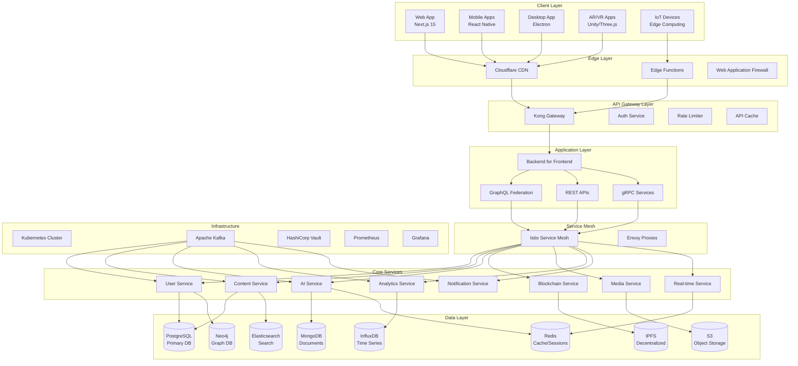

# 🏗️ Sparkle Universe - Project Architecture Document

<div align="center">

### **The Complete Technical Blueprint for Building the Next Evolution of Digital Communities**

**Version 1.0 | Last Updated: July 2024**

</div>

---

## 📋 Table of Contents

1. [Executive Summary](#-executive-summary)
2. [Architecture Overview](#-architecture-overview)
3. [System Design Principles](#-system-design-principles)
4. [Technology Stack Deep Dive](#-technology-stack-deep-dive)
5. [Layer-by-Layer Architecture](#-layer-by-layer-architecture)
6. [Component Design Patterns](#-component-design-patterns)
7. [Data Architecture](#-data-architecture)
8. [Security Architecture](#-security-architecture)
9. [AI/ML Architecture](#-aiml-architecture)
10. [Blockchain Architecture](#-blockchain-architecture)
11. [Real-time Systems Architecture](#-real-time-systems-architecture)
12. [Microservices Design](#-microservices-design)
13. [API Design Specifications](#-api-design-specifications)
14. [Frontend Architecture](#-frontend-architecture)
15. [Testing Architecture](#-testing-architecture)
16. [Performance Architecture](#-performance-architecture)
17. [Deployment Architecture](#-deployment-architecture)
18. [Step-by-Step Implementation Plan](#-step-by-step-implementation-plan)
19. [Development Guidelines](#-development-guidelines)
20. [Architecture Decision Records](#-architecture-decision-records)

---

## 🎯 Executive Summary

Sparkle Universe is architected as a **cloud-native, microservices-based platform** that leverages cutting-edge technologies to deliver an unprecedented community experience. This document serves as the definitive technical guide for building, maintaining, and scaling the platform.

### Key Architectural Highlights

- **Distributed Microservices**: Independent, scalable services communicating via gRPC and event streams
- **AI-First Design**: Machine learning integrated at every layer for intelligent interactions
- **Blockchain Integration**: Decentralized features for ownership, governance, and economy
- **Real-time Infrastructure**: WebSocket and WebRTC for instant, immersive experiences
- **Multi-Platform Support**: Unified codebase supporting web, mobile, AR/VR, and future interfaces
- **Security by Design**: Zero-trust architecture with quantum-resistant cryptography
- **Performance Optimized**: Sub-100ms response times with global edge computing

---

## 🏛️ Architecture Overview

### High-Level System Architecture



### Architectural Layers

1. **Presentation Layer**: Multi-platform client applications
2. **Edge Layer**: CDN, caching, and security at the edge
3. **Gateway Layer**: API management, authentication, rate limiting
4. **Application Layer**: Business logic and API endpoints
5. **Service Layer**: Microservices implementing domain logic
6. **Data Layer**: Polyglot persistence with specialized databases
7. **Infrastructure Layer**: Container orchestration and monitoring

---

## 🎨 System Design Principles

### 1. **Domain-Driven Design (DDD)**

```typescript
// Bounded Contexts
- User Management Domain
- Content Creation Domain
- AI Companion Domain
- Blockchain Economy Domain
- Community Interaction Domain
- Analytics & Insights Domain

// Example: User Domain Aggregate
interface UserAggregate {
  id: UserId;
  profile: UserProfile;
  preferences: UserPreferences;
  aiCompanion: AICompanion;
  reputation: Reputation;
  wallet: BlockchainWallet;
  
  // Domain Events
  events: DomainEvent[];
  
  // Business Logic
  updateProfile(data: ProfileUpdate): Result<void>;
  earnReputation(action: UserAction): Result<ReputationGain>;
  connectWallet(address: WalletAddress): Result<void>;
}
```

### 2. **Event-Driven Architecture**

```typescript
// Event Sourcing Pattern
interface DomainEvent {
  aggregateId: string;
  eventType: string;
  eventData: unknown;
  timestamp: Date;
  version: number;
}

// Example Events
class UserRegisteredEvent implements DomainEvent {
  constructor(
    public aggregateId: string,
    public eventData: {
      email: string;
      username: string;
      registrationSource: string;
    },
    public timestamp = new Date(),
    public version = 1
  ) {}
  
  eventType = 'USER_REGISTERED';
}

// Event Bus
interface EventBus {
  publish(event: DomainEvent): Promise<void>;
  subscribe(eventType: string, handler: EventHandler): void;
}
```

### 3. **CQRS (Command Query Responsibility Segregation)**

```typescript
// Command Side
interface Command {
  execute(): Promise<Result>;
}

class CreatePostCommand implements Command {
  constructor(
    private userId: string,
    private postData: PostCreationData
  ) {}
  
  async execute(): Promise<Result<Post>> {
    // Validate
    const validation = await this.validate();
    if (!validation.isValid) return Result.fail(validation.errors);
    
    // Execute business logic
    const post = await this.postRepository.create(this.postData);
    
    // Publish events
    await this.eventBus.publish(new PostCreatedEvent(post));
    
    return Result.ok(post);
  }
}

// Query Side
interface Query<T> {
  execute(): Promise<T>;
}

class GetTrendingPostsQuery implements Query<Post[]> {
  constructor(
    private timeframe: TimeFrame,
    private limit: number
  ) {}
  
  async execute(): Promise<Post[]> {
    return this.readModelRepository.getTrendingPosts(
      this.timeframe,
      this.limit
    );
  }
}
```

### 4. **Hexagonal Architecture (Ports & Adapters)**

```typescript
// Core Domain (Hexagon Center)
namespace Core {
  // Domain Models
  export class User {
    constructor(
      private id: UserId,
      private profile: UserProfile
    ) {}
  }
  
  // Ports (Interfaces)
  export interface UserRepository {
    findById(id: UserId): Promise<User | null>;
    save(user: User): Promise<void>;
  }
  
  export interface NotificationService {
    sendWelcomeEmail(user: User): Promise<void>;
  }
  
  // Use Cases
  export class RegisterUserUseCase {
    constructor(
      private userRepo: UserRepository,
      private notificationService: NotificationService
    ) {}
    
    async execute(data: RegistrationData): Promise<User> {
      const user = User.create(data);
      await this.userRepo.save(user);
      await this.notificationService.sendWelcomeEmail(user);
      return user;
    }
  }
}

// Adapters (External Implementations)
namespace Adapters {
  export class PostgresUserRepository implements Core.UserRepository {
    async findById(id: UserId): Promise<User | null> {
      const data = await prisma.user.findUnique({ where: { id } });
      return data ? User.fromPersistence(data) : null;
    }
    
    async save(user: User): Promise<void> {
      await prisma.user.upsert({
        where: { id: user.id },
        update: user.toPersistence(),
        create: user.toPersistence()
      });
    }
  }
  
  export class SendGridNotificationService implements Core.NotificationService {
    async sendWelcomeEmail(user: User): Promise<void> {
      await sendgrid.send({
        to: user.email,
        from: 'welcome@sparkle-universe.dev',
        templateId: 'welcome-template',
        dynamicTemplateData: { username: user.username }
      });
    }
  }
}
```

### 5. **Reactive Programming**

```typescript
// Using RxJS for reactive streams
import { Observable, Subject, BehaviorSubject } from 'rxjs';
import { filter, map, debounceTime, distinctUntilChanged } from 'rxjs/operators';

class RealtimeContentStream {
  private contentStream$ = new Subject<Content>();
  private userPreferences$ = new BehaviorSubject<UserPreferences>(defaultPrefs);
  
  getPersonalizedFeed(userId: string): Observable<Content[]> {
    return combineLatest([
      this.contentStream$,
      this.userPreferences$
    ]).pipe(
      // Apply user preferences
      filter(([content, prefs]) => this.matchesPreferences(content, prefs)),
      
      // Batch updates
      bufferTime(100),
      filter(contents => contents.length > 0),
      
      // Apply AI personalization
      mergeMap(contents => this.aiService.personalizeContent(userId, contents)),
      
      // Deduplicate
      distinctUntilChanged((a, b) => JSON.stringify(a) === JSON.stringify(b))
    );
  }
}
```

---

## 💻 Technology Stack Deep Dive

### Frontend Technologies

#### Next.js 15 Configuration

```typescript
// next.config.ts
import { NextConfig } from 'next';

const config: NextConfig = {
  experimental: {
    // App Router optimizations
    typedRoutes: true,
    serverActions: true,
    
    // React 19 features
    ppr: true, // Partial Pre-rendering
    reactCompiler: true,
    
    // Performance optimizations
    optimizePackageImports: ['@sparkle/ui', 'framer-motion', 'three'],
    
    // Turbopack
    turbo: {
      resolveAlias: {
        '@': './src',
        '@ui': './src/components/ui',
        '@features': './src/components/features',
      },
    },
  },
  
  // Image optimization
  images: {
    domains: ['sparkle-cdn.dev', 'cloudinary.com'],
    formats: ['image/avif', 'image/webp'],
    deviceSizes: [640, 750, 828, 1080, 1200, 1920, 2048, 3840],
  },
  
  // Internationalization
  i18n: {
    locales: ['en', 'es', 'fr', 'de', 'ja', 'ko', 'zh'],
    defaultLocale: 'en',
  },
  
  // Security headers
  async headers() {
    return [
      {
        source: '/:path*',
        headers: [
          {
            key: 'Content-Security-Policy',
            value: `
              default-src 'self';
              script-src 'self' 'unsafe-eval' 'unsafe-inline' *.sparkle-universe.dev;
              style-src 'self' 'unsafe-inline' *.googleapis.com;
              img-src 'self' blob: data: *.sparkle-cdn.dev;
              font-src 'self' *.gstatic.com;
              connect-src 'self' wss://*.sparkle-universe.dev https://api.sparkle-universe.dev;
              frame-src 'self' *.youtube.com *.vimeo.com;
            `.replace(/\s{2,}/g, ' ').trim()
          },
          {
            key: 'Permissions-Policy',
            value: 'camera=(), microphone=(), geolocation=(*)'
          }
        ]
      }
    ];
  },
  
  // Webpack customization
  webpack: (config, { isServer }) => {
    // WASM support
    config.experiments = {
      ...config.experiments,
      asyncWebAssembly: true,
      layers: true,
    };
    
    // Three.js optimizations
    if (!isServer) {
      config.resolve.alias = {
        ...config.resolve.alias,
        'three': path.resolve('./node_modules/three'),
      };
    }
    
    return config;
  },
};

export default config;
```

#### TypeScript Configuration

```json
// tsconfig.json
{
  "compilerOptions": {
    "target": "ES2022",
    "lib": ["dom", "dom.iterable", "esnext"],
    "allowJs": true,
    "skipLibCheck": true,
    "strict": true,
    "forceConsistentCasingInFileNames": true,
    "noEmit": true,
    "esModuleInterop": true,
    "module": "esnext",
    "moduleResolution": "bundler",
    "resolveJsonModule": true,
    "isolatedModules": true,
    "jsx": "preserve",
    "incremental": true,
    "plugins": [
      {
        "name": "next"
      }
    ],
    "paths": {
      "@/*": ["./src/*"],
      "@ui/*": ["./src/components/ui/*"],
      "@features/*": ["./src/components/features/*"],
      "@hooks/*": ["./src/hooks/*"],
      "@lib/*": ["./src/lib/*"],
      "@services/*": ["./src/services/*"],
      "@stores/*": ["./src/stores/*"],
      "@types/*": ["./src/types/*"],
      "@utils/*": ["./src/utils/*"]
    },
    "types": ["@types/node", "jest", "@testing-library/jest-dom"]
  },
  "include": ["next-env.d.ts", "**/*.ts", "**/*.tsx", ".next/types/**/*.ts"],
  "exclude": ["node_modules"]
}
```

### Backend Architecture

#### Microservices Structure

```typescript
// Base Service Class
abstract class BaseService {
  protected logger: Logger;
  protected metrics: MetricsCollector;
  protected tracer: Tracer;
  protected healthChecker: HealthChecker;
  
  constructor(protected config: ServiceConfig) {
    this.logger = new Logger(config.serviceName);
    this.metrics = new MetricsCollector(config.serviceName);
    this.tracer = new Tracer(config.serviceName);
    this.healthChecker = new HealthChecker();
  }
  
  async start(): Promise<void> {
    // Initialize database connections
    await this.initializeDatabase();
    
    // Setup message queue listeners
    await this.setupMessageQueues();
    
    // Register service with service discovery
    await this.registerService();
    
    // Start HTTP/gRPC servers
    await this.startServers();
    
    // Setup graceful shutdown
    this.setupGracefulShutdown();
    
    this.logger.info(`${this.config.serviceName} started successfully`);
  }
  
  abstract initializeDatabase(): Promise<void>;
  abstract setupMessageQueues(): Promise<void>;
  abstract startServers(): Promise<void>;
}

// Example: User Service Implementation
class UserService extends BaseService {
  private prisma: PrismaClient;
  private grpcServer: Server;
  private httpServer: Express;
  
  async initializeDatabase(): Promise<void> {
    this.prisma = new PrismaClient({
      datasources: {
        db: {
          url: this.config.databaseUrl,
        },
      },
      log: ['query', 'info', 'warn', 'error'],
    });
    
    // Test connection
    await this.prisma.$connect();
    
    // Run migrations in production
    if (this.config.env === 'production') {
      await execSync('npx prisma migrate deploy');
    }
  }
  
  async setupMessageQueues(): Promise<void> {
    // Kafka setup
    const kafka = new Kafka({
      clientId: this.config.serviceName,
      brokers: this.config.kafkaBrokers,
      ssl: true,
      sasl: {
        mechanism: 'scram-sha-256',
        username: this.config.kafkaUsername,
        password: this.config.kafkaPassword,
      },
    });
    
    // Consumer setup
    const consumer = kafka.consumer({ 
      groupId: `${this.config.serviceName}-group` 
    });
    
    await consumer.connect();
    await consumer.subscribe({ 
      topics: ['user-events', 'auth-events'], 
      fromBeginning: false 
    });
    
    await consumer.run({
      eachMessage: async ({ topic, partition, message }) => {
        await this.handleMessage(topic, message);
      },
    });
    
    // Producer setup
    this.producer = kafka.producer();
    await this.producer.connect();
  }
  
  async startServers(): Promise<void> {
    // gRPC Server
    this.grpcServer = new Server();
    this.grpcServer.addService(UserServiceDefinition, {
      getUser: this.getUser.bind(this),
      createUser: this.createUser.bind(this),
      updateUser: this.updateUser.bind(this),
      deleteUser: this.deleteUser.bind(this),
    });
    
    this.grpcServer.bindAsync(
      `0.0.0.0:${this.config.grpcPort}`,
      ServerCredentials.createInsecure(),
      (err, port) => {
        if (err) throw err;
        this.grpcServer.start();
        this.logger.info(`gRPC server listening on port ${port}`);
      }
    );
    
    // HTTP Server (for health checks and metrics)
    this.httpServer = express();
    this.httpServer.use(helmet());
    this.httpServer.use(compression());
    
    this.httpServer.get('/health', (req, res) => {
      res.json(this.healthChecker.check());
    });
    
    this.httpServer.get('/metrics', (req, res) => {
      res.set('Content-Type', register.contentType);
      res.end(register.metrics());
    });
    
    this.httpServer.listen(this.config.httpPort, () => {
      this.logger.info(`HTTP server listening on port ${this.config.httpPort}`);
    });
  }
}
```

---

## 🏢 Layer-by-Layer Architecture

### 1. Client Layer Architecture

```typescript
// Client Architecture Pattern
interface ClientArchitecture {
  // Rendering Strategy
  rendering: 'ssr' | 'ssg' | 'isr' | 'csr';
  
  // State Management
  stateManagement: {
    client: 'zustand' | 'jotai' | 'valtio';
    server: 'tanstack-query' | 'swr';
    realtime: 'socket.io' | 'pusher';
  };
  
  // Component Architecture
  components: {
    pattern: 'atomic-design';
    styling: 'tailwind' | 'css-modules';
    animation: 'framer-motion' | 'react-spring';
  };
  
  // Performance Optimizations
  optimizations: {
    lazyLoading: boolean;
    codeSplitting: boolean;
    preloading: boolean;
    serviceWorker: boolean;
  };
}

// Web App Structure
const webAppArchitecture: ClientArchitecture = {
  rendering: 'isr', // Incremental Static Regeneration
  stateManagement: {
    client: 'zustand',
    server: 'tanstack-query',
    realtime: 'socket.io'
  },
  components: {
    pattern: 'atomic-design',
    styling: 'tailwind',
    animation: 'framer-motion'
  },
  optimizations: {
    lazyLoading: true,
    codeSplitting: true,
    preloading: true,
    serviceWorker: true
  }
};
```

### 2. API Gateway Layer

```typescript
// Kong Gateway Configuration
interface GatewayConfig {
  plugins: GatewayPlugin[];
  routes: Route[];
  upstreams: Upstream[];
  certificates: Certificate[];
}

const gatewayConfig: GatewayConfig = {
  plugins: [
    {
      name: 'rate-limiting',
      config: {
        minute: 60,
        hour: 10000,
        policy: 'redis',
        redis_host: process.env.REDIS_HOST,
        redis_port: 6379
      }
    },
    {
      name: 'jwt',
      config: {
        secret_is_base64: false,
        claims_to_verify: ['exp', 'nbf'],
        maximum_expiration: 3600
      }
    },
    {
      name: 'cors',
      config: {
        origins: ['https://sparkle-universe.dev'],
        methods: ['GET', 'POST', 'PUT', 'DELETE', 'OPTIONS'],
        headers: ['Accept', 'Content-Type', 'Authorization'],
        exposed_headers: ['X-Total-Count'],
        credentials: true
      }
    },
    {
      name: 'prometheus',
      config: {
        per_consumer: true,
        status_code_metrics: true,
        latency_metrics: true,
        bandwidth_metrics: true
      }
    }
  ],
  routes: [
    {
      name: 'user-service',
      paths: ['/api/v1/users'],
      service: { name: 'user-service' },
      strip_path: false,
      preserve_host: true
    },
    {
      name: 'content-service',
      paths: ['/api/v1/content'],
      service: { name: 'content-service' },
      strip_path: false,
      preserve_host: true
    }
  ],
  upstreams: [
    {
      name: 'user-service',
      targets: [
        { target: 'user-service.default.svc.cluster.local:50051' }
      ],
      healthchecks: {
        active: {
          https_verify_certificate: false,
          unhealthy: { interval: 5, tcp_failures: 3 },
          healthy: { interval: 30, successes: 2 }
        }
      }
    }
  ],
  certificates: [
    {
      cert: process.env.TLS_CERT,
      key: process.env.TLS_KEY,
      snis: ['api.sparkle-universe.dev']
    }
  ]
};
```

### 3. Service Mesh Layer

```yaml
# Istio Service Mesh Configuration
apiVersion: networking.istio.io/v1beta1
kind: VirtualService
metadata:
  name: user-service
spec:
  hosts:
  - user-service
  http:
  - match:
    - headers:
        x-version:
          exact: v2
    route:
    - destination:
        host: user-service
        subset: v2
      weight: 100
  - route:
    - destination:
        host: user-service
        subset: v1
      weight: 90
    - destination:
        host: user-service
        subset: v2
      weight: 10
    timeout: 30s
    retries:
      attempts: 3
      perTryTimeout: 10s
      retryOn: gateway-error,connect-failure,refused-stream

---
apiVersion: networking.istio.io/v1beta1
kind: DestinationRule
metadata:
  name: user-service
spec:
  host: user-service
  trafficPolicy:
    connectionPool:
      tcp:
        maxConnections: 100
      http:
        http1MaxPendingRequests: 100
        http2MaxRequests: 100
        maxRequestsPerConnection: 2
    loadBalancer:
      consistentHash:
        httpCookie:
          name: "session-affinity"
          ttl: 3600s
    outlierDetection:
      consecutiveErrors: 5
      interval: 30s
      baseEjectionTime: 30s
      maxEjectionPercent: 50
  subsets:
  - name: v1
    labels:
      version: v1
  - name: v2
    labels:
      version: v2
```

---

## 🧩 Component Design Patterns

### 1. Repository Pattern

```typescript
// Generic Repository Interface
interface Repository<T, ID> {
  findById(id: ID): Promise<T | null>;
  findAll(options?: FindOptions): Promise<T[]>;
  create(entity: Omit<T, 'id'>): Promise<T>;
  update(id: ID, entity: Partial<T>): Promise<T>;
  delete(id: ID): Promise<void>;
  exists(id: ID): Promise<boolean>;
}

// Base Repository Implementation
abstract class BaseRepository<T, ID> implements Repository<T, ID> {
  constructor(
    protected prisma: PrismaClient,
    protected modelName: string
  ) {}
  
  async findById(id: ID): Promise<T | null> {
    return this.prisma[this.modelName].findUnique({
      where: { id }
    });
  }
  
  async findAll(options?: FindOptions): Promise<T[]> {
    return this.prisma[this.modelName].findMany({
      skip: options?.offset || 0,
      take: options?.limit || 100,
      orderBy: options?.orderBy || { createdAt: 'desc' },
      where: options?.where
    });
  }
  
  async create(entity: Omit<T, 'id'>): Promise<T> {
    return this.prisma[this.modelName].create({
      data: entity
    });
  }
  
  async update(id: ID, entity: Partial<T>): Promise<T> {
    return this.prisma[this.modelName].update({
      where: { id },
      data: entity
    });
  }
  
  async delete(id: ID): Promise<void> {
    await this.prisma[this.modelName].delete({
      where: { id }
    });
  }
  
  async exists(id: ID): Promise<boolean> {
    const count = await this.prisma[this.modelName].count({
      where: { id }
    });
    return count > 0;
  }
}

// Specific Repository Implementation
class UserRepository extends BaseRepository<User, string> {
  constructor(prisma: PrismaClient) {
    super(prisma, 'user');
  }
  
  async findByEmail(email: string): Promise<User | null> {
    return this.prisma.user.findUnique({
      where: { email },
      include: {
        profile: true,
        aiCompanion: true,
        wallet: true
      }
    });
  }
  
  async findByUsername(username: string): Promise<User | null> {
    return this.prisma.user.findUnique({
      where: { username },
      include: {
        profile: true,
        reputation: true
      }
    });
  }
  
  async updateReputation(userId: string, points: number): Promise<void> {
    await this.prisma.$transaction(async (tx) => {
      // Update reputation points
      await tx.reputation.update({
        where: { userId },
        data: {
          points: { increment: points },
          level: this.calculateLevel(points)
        }
      });
      
      // Create reputation history entry
      await tx.reputationHistory.create({
        data: {
          userId,
          points,
          action: 'EARNED',
          timestamp: new Date()
        }
      });
      
      // Check for achievements
      await this.checkAchievements(tx, userId);
    });
  }
  
  private calculateLevel(points: number): number {
    const levels = [0, 100, 500, 1000, 5000, 10000, 50000, 100000];
    return levels.findIndex(threshold => points < threshold) - 1;
  }
  
  private async checkAchievements(
    tx: PrismaTransactionClient,
    userId: string
  ): Promise<void> {
    // Implementation of achievement checking logic
  }
}
```

### 2. Factory Pattern

```typescript
// Abstract Factory for Creating AI Companions
interface AICompanionFactory {
  createPersonality(): Personality;
  createAvatar(): Avatar;
  createVoice(): Voice;
  createMemory(): Memory;
}

// Concrete Factory Implementation
class StandardAICompanionFactory implements AICompanionFactory {
  createPersonality(): Personality {
    return new StandardPersonality({
      traits: this.generateTraits(),
      interests: this.generateInterests(),
      communicationStyle: this.generateCommunicationStyle()
    });
  }
  
  createAvatar(): Avatar {
    return new Avatar3D({
      model: this.selectModel(),
      animations: this.loadAnimations(),
      customizations: this.getDefaultCustomizations()
    });
  }
  
  createVoice(): Voice {
    return new NeuralVoice({
      voiceId: this.selectVoice(),
      pitch: 1.0,
      speed: 1.0,
      emotion: 'neutral'
    });
  }
  
  createMemory(): Memory {
    return new VectorMemory({
      capacity: 1000,
      embeddingModel: 'text-embedding-ada-002',
      retrievalStrategy: 'semantic-similarity'
    });
  }
  
  private generateTraits(): PersonalityTraits {
    // Complex trait generation logic
    return {
      openness: Math.random(),
      conscientiousness: Math.random(),
      extraversion: Math.random(),
      agreeableness: Math.random(),
      neuroticism: Math.random()
    };
  }
}

// Premium Factory with Enhanced Features
class PremiumAICompanionFactory extends StandardAICompanionFactory {
  createPersonality(): Personality {
    return new AdvancedPersonality({
      ...super.createPersonality(),
      emotionalIntelligence: this.generateEmotionalIntelligence(),
      culturalAwareness: this.generateCulturalAwareness(),
      humorStyle: this.generateHumorStyle()
    });
  }
  
  createMemory(): Memory {
    return new QuantumMemory({
      capacity: 10000,
      embeddingModel: 'custom-quantum-embeddings',
      retrievalStrategy: 'quantum-entanglement',
      emotionalWeighting: true,
      temporalDecay: true
    });
  }
}

// Factory Usage
class AICompanionService {
  private factory: AICompanionFactory;
  
  constructor(userTier: UserTier) {
    this.factory = userTier === 'premium' 
      ? new PremiumAICompanionFactory()
      : new StandardAICompanionFactory();
  }
  
  async createCompanion(userId: string): Promise<AICompanion> {
    const personality = this.factory.createPersonality();
    const avatar = this.factory.createAvatar();
    const voice = this.factory.createVoice();
    const memory = this.factory.createMemory();
    
    return new AICompanion({
      userId,
      personality,
      avatar,
      voice,
      memory,
      createdAt: new Date()
    });
  }
}
```

### 3. Observer Pattern for Real-time Updates

```typescript
// Subject Interface
interface Subject<T> {
  attach(observer: Observer<T>): void;
  detach(observer: Observer<T>): void;
  notify(data: T): void;
}

// Observer Interface
interface Observer<T> {
  update(data: T): void;
}

// Real-time Content Stream Implementation
class ContentStream implements Subject<Content> {
  private observers: Set<Observer<Content>> = new Set();
  private contentBuffer: Content[] = [];
  private batchTimer: NodeJS.Timeout | null = null;
  
  attach(observer: Observer<Content>): void {
    this.observers.add(observer);
    
    // Send buffered content to new observer
    if (this.contentBuffer.length > 0) {
      this.contentBuffer.forEach(content => observer.update(content));
    }
  }
  
  detach(observer: Observer<Content>): void {
    this.observers.delete(observer);
  }
  
  notify(content: Content): void {
    // Add to buffer for batching
    this.contentBuffer.push(content);
    
    // Batch notifications for performance
    if (!this.batchTimer) {
      this.batchTimer = setTimeout(() => {
        this.flushBuffer();
      }, 100); // 100ms batching window
    }
  }
  
  private flushBuffer(): void {
    const contents = [...this.contentBuffer];
    this.contentBuffer = [];
    this.batchTimer = null;
    
    // Notify all observers
    this.observers.forEach(observer => {
      contents.forEach(content => observer.update(content));
    });
  }
}

// WebSocket Observer Implementation
class WebSocketObserver implements Observer<Content> {
  constructor(
    private socket: Socket,
    private userId: string
  ) {}
  
  update(content: Content): void {
    // Apply user-specific filtering
    if (this.shouldReceiveContent(content)) {
      this.socket.emit('content:new', {
        content,
        timestamp: Date.now()
      });
    }
  }
  
  private shouldReceiveContent(content: Content): boolean {
    // Check user preferences, blocks, etc.
    return true; // Simplified
  }
}

// Usage in Real-time Service
class RealtimeService {
  private contentStream = new ContentStream();
  private connections = new Map<string, WebSocketObserver>();
  
  handleConnection(socket: Socket, userId: string): void {
    const observer = new WebSocketObserver(socket, userId);
    this.connections.set(socket.id, observer);
    this.contentStream.attach(observer);
    
    socket.on('disconnect', () => {
      const observer = this.connections.get(socket.id);
      if (observer) {
        this.contentStream.detach(observer);
        this.connections.delete(socket.id);
      }
    });
  }
  
  broadcastContent(content: Content): void {
    this.contentStream.notify(content);
  }
}
```

---

## 🗄️ Data Architecture

### Database Schema Design

```prisma
// schema.prisma - Core Models

generator client {
  provider = "prisma-client-js"
  previewFeatures = ["fullTextSearch", "postgresqlExtensions"]
}

datasource db {
  provider = "postgresql"
  url      = env("DATABASE_URL")
  extensions = [pgcrypto, postgis, pgvector]
}

// User Domain
model User {
  id                String    @id @default(dbgenerated("gen_random_uuid()")) @db.Uuid
  email             String    @unique
  username          String    @unique @db.VarChar(30)
  hashedPassword    String?
  emailVerified     DateTime?
  createdAt         DateTime  @default(now())
  updatedAt         DateTime  @updatedAt
  deletedAt         DateTime?
  
  // Profile
  profile           Profile?
  
  // Authentication
  sessions          Session[]
  oauthAccounts     OAuthAccount[]
  twoFactorAuth     TwoFactorAuth?
  
  // AI Companion
  aiCompanion       AICompanion?
  
  // Content
  posts             Post[]
  comments          Comment[]
  reactions         Reaction[]
  
  // Social
  following         Follow[]  @relation("Following")
  followers         Follow[]  @relation("Followers")
  
  // Blockchain
  wallet            Wallet?
  nfts              NFT[]
  transactions      Transaction[]
  
  // Reputation
  reputation        Reputation?
  achievements      Achievement[]
  
  // Notifications
  notifications     Notification[]
  notificationPrefs NotificationPreferences?
  
  @@index([email])
  @@index([username])
  @@index([createdAt])
}

model Profile {
  id              String   @id @default(dbgenerated("gen_random_uuid()")) @db.Uuid
  userId          String   @unique @db.Uuid
  displayName     String   @db.VarChar(100)
  bio             String?  @db.Text
  avatarUrl       String?
  bannerUrl       String?
  location        String?
  website         String?
  pronouns        String?
  timezone        String   @default("UTC")
  
  // Social Links
  socialLinks     Json?    @db.JsonB
  
  // Customization
  theme           String   @default("system")
  accentColor     String   @default("#6366f1")
  
  // Privacy
  isPublic        Boolean  @default(true)
  showEmail       Boolean  @default(false)
  
  user            User     @relation(fields: [userId], references: [id], onDelete: Cascade)
  
  @@index([userId])
}

model AICompanion {
  id              String   @id @default(dbgenerated("gen_random_uuid()")) @db.Uuid
  userId          String   @unique @db.Uuid
  name            String   @db.VarChar(50)
  personality     Json     @db.JsonB // Personality traits, interests, etc.
  avatarConfig    Json     @db.JsonB // 3D model configuration
  voiceId         String
  
  // Memory
  memoryVectors   CompanionMemory[]
  
  // Learning
  interactions    Int      @default(0)
  lastInteraction DateTime?
  learningState   Json     @db.JsonB // Neural network state
  
  // Customization
  customTraits    Json?    @db.JsonB
  restrictions    Json?    @db.JsonB // User-defined boundaries
  
  createdAt       DateTime @default(now())
  updatedAt       DateTime @updatedAt
  
  user            User     @relation(fields: [userId], references: [id], onDelete: Cascade)
  
  @@index([userId])
}

model CompanionMemory {
  id              String      @id @default(dbgenerated("gen_random_uuid()")) @db.Uuid
  companionId     String      @db.Uuid
  content         String      @db.Text
  embedding       Unsupported("vector(1536)") // pgvector embedding
  metadata        Json        @db.JsonB
  importance      Float       @default(1.0)
  accessCount     Int         @default(0)
  lastAccessed    DateTime?
  createdAt       DateTime    @default(now())
  
  companion       AICompanion @relation(fields: [companionId], references: [id], onDelete: Cascade)
  
  @@index([companionId])
  @@index([createdAt])
}

// Content Domain
model Post {
  id              String   @id @default(dbgenerated("gen_random_uuid()")) @db.Uuid
  authorId        String   @db.Uuid
  title           String   @db.VarChar(300)
  slug            String   @unique
  content         Json     @db.JsonB // Rich content with blocks
  excerpt         String?  @db.Text
  coverImage      String?
  
  // Metadata
  tags            Tag[]
  category        Category? @relation(fields: [categoryId], references: [id])
  categoryId      String?   @db.Uuid
  
  // Status
  status          PostStatus @default(DRAFT)
  publishedAt     DateTime?
  featuredAt      DateTime?
  
  // Interaction
  viewCount       Int      @default(0)
  shareCount      Int      @default(0)
  comments        Comment[]
  reactions       Reaction[]
  
  // AI Enhancement
  aiSuggestions   Json?    @db.JsonB
  readingTime     Int?     // in minutes
  sentiment       Float?   // -1 to 1
  
  // Blockchain
  nftTokenId      String?  @unique
  
  createdAt       DateTime @default(now())
  updatedAt       DateTime @updatedAt
  deletedAt       DateTime?
  
  author          User     @relation(fields: [authorId], references: [id])
  
  @@index([authorId])
  @@index([slug])
  @@index([status, publishedAt])
  @@index([categoryId])
  @@fulltext([title])
}

enum PostStatus {
  DRAFT
  PUBLISHED
  ARCHIVED
  REMOVED
}

// Blockchain Domain
model Wallet {
  id              String   @id @default(dbgenerated("gen_random_uuid()")) @db.Uuid
  userId          String   @unique @db.Uuid
  address         String   @unique @db.VarChar(42)
  chainId         Int
  
  // Balances
  sparkBalance    Decimal  @default(0) @db.Decimal(36, 18)
  ethBalance      Decimal  @default(0) @db.Decimal(36, 18)
  
  // Security
  encryptedKey    String?  // Encrypted private key for custodial wallets
  isExternal      Boolean  @default(true) // true = MetaMask, false = custodial
  
  // Activity
  lastActivity    DateTime?
  totalGasSpent   Decimal  @default(0) @db.Decimal(36, 18)
  
  createdAt       DateTime @default(now())
  updatedAt       DateTime @updatedAt
  
  user            User     @relation(fields: [userId], references: [id])
  transactions    Transaction[]
  nfts            NFT[]
  
  @@index([address])
  @@index([userId])
}

model NFT {
  id              String   @id @default(dbgenerated("gen_random_uuid()")) @db.Uuid
  tokenId         String   @unique
  contractAddress String   @db.VarChar(42)
  ownerAddress    String   @db.VarChar(42)
  creatorId       String   @db.Uuid
  
  // Metadata
  name            String
  description     String?  @db.Text
  imageUrl        String
  animationUrl    String?
  attributes      Json     @db.JsonB
  
  // Post Link
  postId          String?  @unique @db.Uuid
  
  // Trading
  isListed        Boolean  @default(false)
  listPrice       Decimal? @db.Decimal(36, 18)
  lastSalePrice   Decimal? @db.Decimal(36, 18)
  
  mintedAt        DateTime
  createdAt       DateTime @default(now())
  updatedAt       DateTime @updatedAt
  
  creator         User     @relation(fields: [creatorId], references: [id])
  currentOwner    Wallet   @relation(fields: [ownerAddress], references: [address])
  
  @@index([tokenId])
  @@index([ownerAddress])
  @@index([creatorId])
}

// Analytics Domain
model Event {
  id              String   @id @default(dbgenerated("gen_random_uuid()")) @db.Uuid
  userId          String?  @db.Uuid
  sessionId       String   @db.Uuid
  eventType       String   @db.VarChar(100)
  eventData       Json     @db.JsonB
  
  // Context
  ip              String?  @db.Inet
  userAgent       String?
  referer         String?
  
  // Location (using PostGIS)
  location        Unsupported("geography(Point, 4326)")?
  country         String?  @db.VarChar(2)
  city            String?
  
  timestamp       DateTime @default(now())
  
  @@index([userId, timestamp])
  @@index([eventType, timestamp])
  @@index([sessionId])
  
  // Partitioning by month for performance
  @@map("events")
}
```

### Data Access Layer

```typescript
// Unit of Work Pattern
interface UnitOfWork {
  users: UserRepository;
  posts: PostRepository;
  wallets: WalletRepository;
  
  beginTransaction(): Promise<void>;
  commit(): Promise<void>;
  rollback(): Promise<void>;
}

class PrismaUnitOfWork implements UnitOfWork {
  private transaction: PrismaTransactionClient | null = null;
  
  constructor(private prisma: PrismaClient) {}
  
  get users(): UserRepository {
    return new UserRepository(this.transaction || this.prisma);
  }
  
  get posts(): PostRepository {
    return new PostRepository(this.transaction || this.prisma);
  }
  
  get wallets(): WalletRepository {
    return new WalletRepository(this.transaction || this.prisma);
  }
  
  async beginTransaction(): Promise<void> {
    if (this.transaction) {
      throw new Error('Transaction already in progress');
    }
    
    // Start interactive transaction
    this.transaction = await this.prisma.$transaction.start();
  }
  
  async commit(): Promise<void> {
    if (!this.transaction) {
      throw new Error('No transaction to commit');
    }
    
    await this.transaction.$commit();
    this.transaction = null;
  }
  
  async rollback(): Promise<void> {
    if (!this.transaction) {
      throw new Error('No transaction to rollback');
    }
    
    await this.transaction.$rollback();
    this.transaction = null;
  }
}

// Usage Example
class CreatePostWithNFTUseCase {
  constructor(private uow: UnitOfWork) {}
  
  async execute(data: CreatePostData): Promise<Post> {
    await this.uow.beginTransaction();
    
    try {
      // Create post
      const post = await this.uow.posts.create({
        ...data,
        status: 'PUBLISHED',
        publishedAt: new Date()
      });
      
      // Mint NFT if requested
      if (data.mintAsNFT) {
        const nft = await this.mintNFT(post);
        await this.uow.posts.update(post.id, {
          nftTokenId: nft.tokenId
        });
      }
      
      // Update user reputation
      await this.uow.users.updateReputation(
        data.authorId,
        ReputationPoints.POST_CREATED
      );
      
      await this.uow.commit();
      return post;
      
    } catch (error) {
      await this.uow.rollback();
      throw error;
    }
  }
  
  private async mintNFT(post: Post): Promise<NFT> {
    // NFT minting logic
    return {} as NFT;
  }
}
```

---

## 🔐 Security Architecture

### Authentication & Authorization

```typescript
// Multi-layer Security Architecture
interface SecurityLayer {
  authenticate(request: Request): Promise<AuthResult>;
  authorize(user: User, resource: Resource, action: Action): Promise<boolean>;
  audit(event: SecurityEvent): Promise<void>;
}

// JWT Authentication Service
class JWTAuthService {
  private readonly accessTokenSecret = process.env.JWT_ACCESS_SECRET!;
  private readonly refreshTokenSecret = process.env.JWT_REFRESH_SECRET!;
  private readonly accessTokenExpiry = '15m';
  private readonly refreshTokenExpiry = '7d';
  
  generateTokenPair(user: User): TokenPair {
    const payload: JWTPayload = {
      sub: user.id,
      email: user.email,
      roles: user.roles,
      iat: Date.now()
    };
    
    const accessToken = jwt.sign(payload, this.accessTokenSecret, {
      expiresIn: this.accessTokenExpiry,
      algorithm: 'RS256'
    });
    
    const refreshToken = jwt.sign(
      { sub: user.id },
      this.refreshTokenSecret,
      {
        expiresIn: this.refreshTokenExpiry,
        algorithm: 'RS256'
      }
    );
    
    return { accessToken, refreshToken };
  }
  
  async verifyAccessToken(token: string): Promise<JWTPayload> {
    try {
      const payload = jwt.verify(token, this.accessTokenSecret) as JWTPayload;
      
      // Additional checks
      await this.checkTokenRevocation(payload.jti);
      await this.checkUserStatus(payload.sub);
      
      return payload;
    } catch (error) {
      throw new UnauthorizedError('Invalid access token');
    }
  }
  
  private async checkTokenRevocation(jti: string): Promise<void> {
    const isRevoked = await redis.exists(`revoked:${jti}`);
    if (isRevoked) {
      throw new UnauthorizedError('Token has been revoked');
    }
  }
  
  private async checkUserStatus(userId: string): Promise<void> {
    const user = await prisma.user.findUnique({
      where: { id: userId },
      select: { status: true }
    });
    
    if (!user || user.status !== 'ACTIVE') {
      throw new UnauthorizedError('User account is not active');
    }
  }
}

// RBAC Authorization
class RBACAuthorization {
  private permissions: Map<string, Set<string>> = new Map();
  
  constructor() {
    this.loadPermissions();
  }
  
  private loadPermissions(): void {
    // Role -> Permissions mapping
    this.permissions.set('user', new Set([
      'post:read',
      'post:create',
      'post:update:own',
      'post:delete:own',
      'comment:create',
      'comment:update:own'
    ]));
    
    this.permissions.set('moderator', new Set([
      ...this.permissions.get('user')!,
      'post:update:any',
      'post:delete:any',
      'comment:delete:any',
      'user:warn',
      'user:suspend'
    ]));
    
    this.permissions.set('admin', new Set([
      ...this.permissions.get('moderator')!,
      'user:create',
      'user:update:any',
      'user:delete:any',
      'system:configure',
      'analytics:view:all'
    ]));
  }
  
  can(user: User, action: string, resource?: Resource): boolean {
    const userPermissions = this.getUserPermissions(user);
    
    // Check direct permission
    if (userPermissions.has(action)) {
      return true;
    }
    
    // Check ownership-based permissions
    if (resource && action.endsWith(':own')) {
      const baseAction = action.replace(':own', ':any');
      return userPermissions.has(baseAction) || 
             (resource.ownerId === user.id && userPermissions.has(action));
    }
    
    return false;
  }
  
  private getUserPermissions(user: User): Set<string> {
    const permissions = new Set<string>();
    
    user.roles.forEach(role => {
      const rolePermissions = this.permissions.get(role);
      if (rolePermissions) {
        rolePermissions.forEach(permission => permissions.add(permission));
      }
    });
    
    return permissions;
  }
}

// Zero-Trust Security Middleware
class ZeroTrustMiddleware {
  async authenticate(req: Request): Promise<void> {
    // 1. Verify device trust
    await this.verifyDevice(req);
    
    // 2. Check network location
    await this.verifyNetworkLocation(req);
    
    // 3. Validate session
    await this.validateSession(req);
    
    // 4. Risk assessment
    const riskScore = await this.assessRisk(req);
    if (riskScore > 0.7) {
      throw new SecurityError('High risk detected');
    }
    
    // 5. Apply conditional access
    await this.applyConditionalAccess(req);
  }
  
  private async verifyDevice(req: Request): Promise<void> {
    const deviceId = req.headers['x-device-id'];
    const deviceFingerprint = req.headers['x-device-fingerprint'];
    
    if (!deviceId || !deviceFingerprint) {
      throw new SecurityError('Device verification required');
    }
    
    const device = await prisma.trustedDevice.findUnique({
      where: { id: deviceId }
    });
    
    if (!device || device.fingerprint !== deviceFingerprint) {
      throw new SecurityError('Untrusted device');
    }
  }
  
  private async assessRisk(req: Request): Promise<number> {
    const factors = {
      unusualLocation: await this.isUnusualLocation(req),
      unusualTime: this.isUnusualTime(req),
      suspiciousPattern: await this.detectSuspiciousPattern(req),
      deviceTrust: await this.getDeviceTrustScore(req)
    };
    
    // ML-based risk scoring
    return this.mlRiskModel.predict(factors);
  }
}
```

### Encryption & Data Protection

```typescript
// Encryption Service
class EncryptionService {
  private readonly algorithm = 'aes-256-gcm';
  private readonly keyDerivationIterations = 100000;
  
  // Field-level encryption for sensitive data
  async encryptField(data: string, context: EncryptionContext): Promise<EncryptedData> {
    const key = await this.deriveKey(context);
    const iv = crypto.randomBytes(16);
    const cipher = crypto.createCipheriv(this.algorithm, key, iv);
    
    const encrypted = Buffer.concat([
      cipher.update(data, 'utf8'),
      cipher.final()
    ]);
    
    const authTag = cipher.getAuthTag();
    
    return {
      encrypted: encrypted.toString('base64'),
      iv: iv.toString('base64'),
      authTag: authTag.toString('base64'),
      algorithm: this.algorithm,
      keyId: context.keyId
    };
  }
  
  async decryptField(encryptedData: EncryptedData, context: EncryptionContext): Promise<string> {
    const key = await this.deriveKey(context);
    const decipher = crypto.createDecipheriv(
      encryptedData.algorithm,
      key,
      Buffer.from(encryptedData.iv, 'base64')
    );
    
    decipher.setAuthTag(Buffer.from(encryptedData.authTag, 'base64'));
    
    const decrypted = Buffer.concat([
      decipher.update(Buffer.from(encryptedData.encrypted, 'base64')),
      decipher.final()
    ]);
    
    return decrypted.toString('utf8');
  }
  
  private async deriveKey(context: EncryptionContext): Promise<Buffer> {
    const masterKey = await this.getMasterKey(context.keyId);
    
    return crypto.pbkdf2Sync(
      masterKey,
      context.salt,
      this.keyDerivationIterations,
      32,
      'sha256'
    );
  }
  
  private async getMasterKey(keyId: string): Promise<Buffer> {
    // Fetch from HashiCorp Vault
    const vault = new Vault({
      endpoint: process.env.VAULT_ENDPOINT,
      token: process.env.VAULT_TOKEN
    });
    
    const response = await vault.read(`secret/data/encryption-keys/${keyId}`);
    return Buffer.from(response.data.key, 'base64');
  }
}

// Quantum-Resistant Cryptography
class QuantumResistantCrypto {
  // Using Kyber for key encapsulation
  async generateKeyPair(): Promise<KyberKeyPair> {
    const { publicKey, privateKey } = await kyber.keypair();
    
    return {
      publicKey: Buffer.from(publicKey).toString('base64'),
      privateKey: Buffer.from(privateKey).toString('base64'),
      algorithm: 'kyber1024'
    };
  }
  
  // Using Dilithium for digital signatures
  async sign(message: string, privateKey: string): Promise<string> {
    const signature = await dilithium.sign(
      Buffer.from(message),
      Buffer.from(privateKey, 'base64')
    );
    
    return Buffer.from(signature).toString('base64');
  }
  
  async verify(message: string, signature: string, publicKey: string): Promise<boolean> {
    return dilithium.verify(
      Buffer.from(message),
      Buffer.from(signature, 'base64'),
      Buffer.from(publicKey, 'base64')
    );
  }
}
```

---

## 🤖 AI/ML Architecture

### AI Service Architecture

```python
# AI Service Core Architecture
from typing import List, Dict, Any, Optional
import asyncio
from dataclasses import dataclass
from transformers import pipeline, AutoModel, AutoTokenizer
import torch
from langchain import LLMChain, PromptTemplate
from sentence_transformers import SentenceTransformer
import numpy as np

@dataclass
class AIConfig:
    """AI Service Configuration"""
    model_cache_dir: str = "/models"
    max_batch_size: int = 32
    inference_timeout: float = 30.0
    gpu_memory_fraction: float = 0.8
    enable_quantization: bool = True
    
class AIService:
    """Core AI Service Implementation"""
    
    def __init__(self, config: AIConfig):
        self.config = config
        self._initialize_models()
        self._setup_pipelines()
        
    def _initialize_models(self):
        """Load and initialize all AI models"""
        # Language Models
        self.llm = self._load_llm()
        self.embedder = SentenceTransformer('all-mpnet-base-v2')
        
        # Specialized Models
        self.sentiment_analyzer = pipeline(
            "sentiment-analysis",
            model="nlptown/bert-base-multilingual-uncased-sentiment"
        )
        
        self.content_moderator = pipeline(
            "text-classification",
            model="unitary/toxic-bert"
        )
        
        self.image_generator = self._load_stable_diffusion()
        self.voice_synthesizer = self._load_tts_model()
        
    def _load_llm(self):
        """Load Large Language Model with optimizations"""
        model = AutoModel.from_pretrained(
            "meta-llama/Llama-2-70b-chat-hf",
            cache_dir=self.config.model_cache_dir,
            load_in_8bit=self.config.enable_quantization,
            device_map="auto",
            torch_dtype=torch.float16
        )
        
        tokenizer = AutoTokenizer.from_pretrained(
            "meta-llama/Llama-2-70b-chat-hf"
        )
        
        return LLMChain(
            llm=model,
            tokenizer=tokenizer,
            prompt=self._get_system_prompt()
        )
        
    def _get_system_prompt(self) -> PromptTemplate:
        """Define system prompt for AI companions"""
        template = """
        You are {companion_name}, an AI companion with the following personality:
        {personality_description}
        
        User's message: {user_message}
        Context from previous conversations: {context}
        
        Respond in a way that matches your personality while being helpful and engaging.
        Consider the user's emotional state: {emotional_context}
        
        Response:
        """
        
        return PromptTemplate(
            input_variables=[
                "companion_name",
                "personality_description", 
                "user_message",
                "context",
                "emotional_context"
            ],
            template=template
        )

class AICompanionService:
    """AI Companion Management Service"""
    
    def __init__(self, ai_service: AIService):
        self.ai_service = ai_service
        self.memory_store = VectorMemoryStore()
        self.personality_engine = PersonalityEngine()
        
    async def generate_response(
        self,
        companion_id: str,
        user_message: str,
        conversation_history: List[Dict[str, str]]
    ) -> Dict[str, Any]:
        """Generate AI companion response"""
        
        # Load companion data
        companion = await self._load_companion(companion_id)
        
        # Retrieve relevant memories
        memories = await self.memory_store.retrieve_memories(
            companion_id,
            user_message,
            limit=5
        )
        
        # Analyze emotional context
        emotion_analysis = await self._analyze_emotion(user_message)
        
        # Generate response
        response = await self.ai_service.llm.agenerate(
            companion_name=companion.name,
            personality_description=companion.personality.description,
            user_message=user_message,
            context=self._format_context(memories, conversation_history),
            emotional_context=emotion_analysis
        )
        
        # Store interaction in memory
        await self.memory_store.store_memory(
            companion_id,
            user_message,
            response,
            emotion_analysis
        )
        
        # Update companion learning state
        await self._update_learning_state(companion_id, user_message, response)
        
        return {
            "response": response,
            "emotion": emotion_analysis,
            "suggested_actions": await self._generate_suggestions(companion_id, response)
        }
        
    async def _analyze_emotion(self, text: str) -> Dict[str, float]:
        """Analyze emotional content of text"""
        # Use multiple models for robust emotion detection
        sentiment = self.ai_service.sentiment_analyzer(text)[0]
        
        # Custom emotion detection
        emotions = await self._detect_emotions(text)
        
        return {
            "sentiment": sentiment["score"],
            "emotions": emotions,
            "intensity": self._calculate_emotional_intensity(emotions)
        }

class PersonalityEngine:
    """Engine for generating and evolving AI personalities"""
    
    def generate_personality(self, user_preferences: Dict[str, Any]) -> Personality:
        """Generate unique personality based on user preferences"""
        
        # Base personality traits (Big Five)
        traits = self._generate_base_traits()
        
        # Communication style
        communication_style = self._determine_communication_style(traits)
        
        # Interests and knowledge areas
        interests = self._generate_interests(user_preferences)
        
        # Quirks and unique behaviors
        quirks = self._generate_quirks(traits, interests)
        
        return Personality(
            traits=traits,
            communication_style=communication_style,
            interests=interests,
            quirks=quirks,
            voice_characteristics=self._generate_voice_profile(traits)
        )
        
    def evolve_personality(
        self,
        current_personality: Personality,
        interactions: List[Interaction]
    ) -> Personality:
        """Evolve personality based on user interactions"""
        
        # Analyze interaction patterns
        patterns = self._analyze_interaction_patterns(interactions)
        
        # Adjust traits based on user preferences
        evolved_traits = self._evolve_traits(
            current_personality.traits,
            patterns
        )
        
        # Adapt communication style
        evolved_style = self._adapt_communication_style(
            current_personality.communication_style,
            patterns
        )
        
        # Learn new interests
        evolved_interests = self._expand_interests(
            current_personality.interests,
            interactions
        )
        
        return Personality(
            traits=evolved_traits,
            communication_style=evolved_style,
            interests=evolved_interests,
            quirks=current_personality.quirks,
            voice_characteristics=current_personality.voice_characteristics
        )

class VectorMemoryStore:
    """Vector-based memory storage for AI companions"""
    
    def __init__(self):
        self.index = self._initialize_vector_index()
        self.metadata_store = self._initialize_metadata_store()
        
    async def store_memory(
        self,
        companion_id: str,
        user_input: str,
        ai_response: str,
        emotional_context: Dict[str, Any]
    ):
        """Store interaction as memory vector"""
        
        # Create memory text
        memory_text = f"User: {user_input}\nAssistant: {ai_response}"
        
        # Generate embedding
        embedding = self.ai_service.embedder.encode(memory_text)
        
        # Calculate importance score
        importance = self._calculate_importance(
            user_input,
            ai_response,
            emotional_context
        )
        
        # Store in vector index
        memory_id = str(uuid.uuid4())
        self.index.add_items(
            [embedding],
            [memory_id]
        )
        
        # Store metadata
        await self.metadata_store.set(memory_id, {
            "companion_id": companion_id,
            "timestamp": datetime.utcnow().isoformat(),
            "user_input": user_input,
            "ai_response": ai_response,
            "emotional_context": emotional_context,
            "importance": importance,
            "access_count": 0
        })
        
    async def retrieve_memories(
        self,
        companion_id: str,
        query: str,
        limit: int = 5
    ) -> List[Memory]:
        """Retrieve relevant memories using semantic search"""
        
        # Generate query embedding
        query_embedding = self.ai_service.embedder.encode(query)
        
        # Search vector index
        distances, indices = self.index.search(
            np.array([query_embedding]),
            limit * 2  # Get more to filter by companion
        )
        
        # Filter and retrieve memories
        memories = []
        for idx, distance in zip(indices[0], distances[0]):
            memory_id = self.index.get_ids([idx])[0]
            metadata = await self.metadata_store.get(memory_id)
            
            if metadata["companion_id"] == companion_id:
                memories.append(Memory(
                    id=memory_id,
                    content=metadata,
                    relevance_score=1 / (1 + distance)
                ))
                
                # Update access count
                metadata["access_count"] += 1
                metadata["last_accessed"] = datetime.utcnow().isoformat()
                await self.metadata_store.set(memory_id, metadata)
                
            if len(memories) >= limit:
                break
                
        return memories
```

### ML Pipeline Architecture

```python
# ML Pipeline for Content Understanding and Generation

class ContentUnderstandingPipeline:
    """Pipeline for understanding and enhancing user content"""
    
    def __init__(self):
        self.nlp_processor = NLPProcessor()
        self.vision_processor = VisionProcessor()
        self.multimodal_processor = MultimodalProcessor()
        
    async def process_content(self, content: Content) -> EnhancedContent:
        """Process content through ML pipeline"""
        
        # Extract features based on content type
        if content.type == ContentType.TEXT:
            features = await self.nlp_processor.extract_features(content.text)
        elif content.type == ContentType.IMAGE:
            features = await self.vision_processor.extract_features(content.image)
        elif content.type == ContentType.VIDEO:
            features = await self.multimodal_processor.extract_features(content)
        
        # Generate enhancements
        enhancements = await self._generate_enhancements(content, features)
        
        # Apply safety checks
        safety_result = await self._check_content_safety(content, features)
        
        return EnhancedContent(
            original=content,
            features=features,
            enhancements=enhancements,
            safety_score=safety_result.score,
            safety_flags=safety_result.flags
        )
        
class RecommendationEngine:
    """ML-powered recommendation system"""
    
    def __init__(self):
        self.collaborative_filter = CollaborativeFilteringModel()
        self.content_filter = ContentBasedFilteringModel()
        self.hybrid_model = HybridRecommendationModel()
        self.online_learner = OnlineLearningModel()
        
    async def get_recommendations(
        self,
        user_id: str,
        context: RecommendationContext
    ) -> List[Recommendation]:
        """Generate personalized recommendations"""
        
        # Get user embeddings
        user_embedding = await self._get_user_embedding(user_id)
        
        # Generate candidates from different models
        collaborative_candidates = await self.collaborative_filter.predict(
            user_id,
            limit=100
        )
        
        content_candidates = await self.content_filter.predict(
            user_embedding,
            context,
            limit=100
        )
        
        # Merge and rank candidates
        final_recommendations = await self.hybrid_model.rank(
            user_id,
            collaborative_candidates + content_candidates,
            context
        )
        
        # Apply business rules and filters
        filtered_recommendations = self._apply_business_rules(
            final_recommendations,
            context
        )
        
        # Update online learning model
        asyncio.create_task(
            self.online_learner.update(user_id, filtered_recommendations)
        )
        
        return filtered_recommendations[:context.limit]
        
class AnomalyDetectionSystem:
    """Real-time anomaly detection for security and quality"""
    
    def __init__(self):
        self.isolation_forest = IsolationForestModel()
        self.autoencoder = AutoencoderAnomalyDetector()
        self.statistical_detector = StatisticalAnomalyDetector()
        
    async def detect_anomalies(
        self,
        event_stream: AsyncIterator[Event]
    ) -> AsyncIterator[Anomaly]:
        """Detect anomalies in real-time event stream"""
        
        async for event in event_stream:
            # Extract features
            features = await self._extract_features(event)
            
            # Run through multiple detectors
            isolation_score = self.isolation_forest.predict(features)
            autoencoder_score = self.autoencoder.predict(features)
            statistical_score = await self.statistical_detector.predict(
                event,
                historical_context=True
            )
            
            # Ensemble decision
            anomaly_score = self._ensemble_score(
                isolation_score,
                autoencoder_score,
                statistical_score
            )
            
            if anomaly_score > ANOMALY_THRESHOLD:
                yield Anomaly(
                    event=event,
                    score=anomaly_score,
                    type=self._classify_anomaly(event, features),
                    recommended_action=self._recommend_action(event, anomaly_score)
                )
```

---

## ⛓️ Blockchain Architecture

### Smart Contract Architecture

```solidity
// SPDX-License-Identifier: MIT
pragma solidity ^0.8.19;

import "@openzeppelin/contracts-upgradeable/token/ERC20/ERC20Upgradeable.sol";
import "@openzeppelin/contracts-upgradeable/token/ERC721/ERC721Upgradeable.sol";
import "@openzeppelin/contracts-upgradeable/security/PausableUpgradeable.sol";
import "@openzeppelin/contracts-upgradeable/access/AccessControlUpgradeable.sol";
import "@openzeppelin/contracts-upgradeable/proxy/utils/Initializable.sol";

/**
 * @title SparkleToken
 * @dev Main platform token with advanced features
 */
contract SparkleToken is 
    Initializable, 
    ERC20Upgradeable, 
    PausableUpgradeable, 
    AccessControlUpgradeable 
{
    bytes32 public constant MINTER_ROLE = keccak256("MINTER_ROLE");
    bytes32 public constant GOVERNANCE_ROLE = keccak256("GOVERNANCE_ROLE");
    
    // Staking mechanism
    mapping(address => uint256) public stakedBalance;
    mapping(address => uint256) public stakingTimestamp;
    mapping(address => uint256) public accumulatedRewards;
    
    // Tokenomics
    uint256 public constant MAX_SUPPLY = 1_000_000_000 * 10**18; // 1 billion tokens
    uint256 public rewardRate; // Rewards per second per token staked
    
    // Events
    event Staked(address indexed user, uint256 amount);
    event Unstaked(address indexed user, uint256 amount);
    event RewardsClaimed(address indexed user, uint256 amount);
    
    function initialize() public initializer {
        __ERC20_init("Sparkle", "SPARK");
        __Pausable_init();
        __AccessControl_init();
        
        _grantRole(DEFAULT_ADMIN_ROLE, msg.sender);
        _grantRole(MINTER_ROLE, msg.sender);
        _grantRole(GOVERNANCE_ROLE, msg.sender);
        
        rewardRate = 1 * 10**15; // 0.001 SPARK per second per token staked
    }
    
    /**
     * @dev Stake tokens to earn rewards
     */
    function stake(uint256 amount) external whenNotPaused {
        require(amount > 0, "Cannot stake 0 tokens");
        require(balanceOf(msg.sender) >= amount, "Insufficient balance");
        
        // Claim pending rewards first
        _claimRewards(msg.sender);
        
        // Transfer tokens to contract
        _transfer(msg.sender, address(this), amount);
        
        // Update staking info
        stakedBalance[msg.sender] += amount;
        stakingTimestamp[msg.sender] = block.timestamp;
        
        emit Staked(msg.sender, amount);
    }
    
    /**
     * @dev Calculate pending rewards
     */
    function pendingRewards(address user) public view returns (uint256) {
        if (stakedBalance[user] == 0) return accumulatedRewards[user];
        
        uint256 timeDiff = block.timestamp - stakingTimestamp[user];
        uint256 rewards = (stakedBalance[user] * timeDiff * rewardRate) / 10**18;
        
        return accumulatedRewards[user] + rewards;
    }
    
    /**
     * @dev Internal function to claim rewards
     */
    function _claimRewards(address user) internal {
        uint256 rewards = pendingRewards(user);
        if (rewards > 0) {
            accumulatedRewards[user] = 0;
            stakingTimestamp[user] = block.timestamp;
            _mint(user, rewards);
            
            emit RewardsClaimed(user, rewards);
        }
    }
    
    /**
     * @dev Unstake tokens
     */
    function unstake(uint256 amount) external {
        require(amount > 0, "Cannot unstake 0 tokens");
        require(stakedBalance[msg.sender] >= amount, "Insufficient staked balance");
        
        // Claim pending rewards
        _claimRewards(msg.sender);
        
        // Update staking info
        stakedBalance[msg.sender] -= amount;
        
        // Transfer tokens back to user
        _transfer(address(this), msg.sender, amount);
        
        emit Unstaked(msg.sender, amount);
    }
    
    /**
     * @dev Governance function to update reward rate
     */
    function updateRewardRate(uint256 newRate) external onlyRole(GOVERNANCE_ROLE) {
        rewardRate = newRate;
    }
}

/**
 * @title SparkleNFT
 * @dev NFT contract for content and collectibles
 */
contract SparkleNFT is 
    Initializable,
    ERC721Upgradeable,
    AccessControlUpgradeable
{
    using CountersUpgradeable for CountersUpgradeable.Counter;
    
    bytes32 public constant MINTER_ROLE = keccak256("MINTER_ROLE");
    
    CountersUpgradeable.Counter private _tokenIdCounter;
    
    // Token metadata
    mapping(uint256 => TokenMetadata) public tokenMetadata;
    
    // Royalty info
    mapping(uint256 => RoyaltyInfo) public royalties;
    
    struct TokenMetadata {
        string uri;
        address creator;
        uint256 createdAt;
        ContentType contentType;
        bool isLocked; // For soulbound tokens
    }
    
    struct RoyaltyInfo {
        address recipient;
        uint256 percentage; // Basis points (10000 = 100%)
    }
    
    enum ContentType {
        POST,
        ARTWORK,
        ACHIEVEMENT,
        COLLECTIBLE
    }
    
    event NFTMinted(
        uint256 indexed tokenId,
        address indexed creator,
        address indexed owner,
        ContentType contentType
    );
    
    function initialize() public initializer {
        __ERC721_init("Sparkle NFT", "SNFT");
        __AccessControl_init();
        
        _grantRole(DEFAULT_ADMIN_ROLE, msg.sender);
        _grantRole(MINTER_ROLE, msg.sender);
    }
    
    /**
     * @dev Mint new NFT
     */
    function mintNFT(
        address to,
        string memory uri,
        ContentType contentType,
        uint256 royaltyPercentage
    ) public onlyRole(MINTER_ROLE) returns (uint256) {
        require(royaltyPercentage <= 1000, "Royalty too high"); // Max 10%
        
        uint256 tokenId = _tokenIdCounter.current();
        _tokenIdCounter.increment();
        
        _safeMint(to, tokenId);
        
        // Set metadata
        tokenMetadata[tokenId] = TokenMetadata({
            uri: uri,
            creator: to,
            createdAt: block.timestamp,
            contentType: contentType,
            isLocked: false
        });
        
        // Set royalty
        royalties[tokenId] = RoyaltyInfo({
            recipient: to,
            percentage: royaltyPercentage
        });
        
        emit NFTMinted(tokenId, to, to, contentType);
        
        return tokenId;
    }
    
    /**
     * @dev Make token soulbound (non-transferable)
     */
    function lockToken(uint256 tokenId) external {
        require(ownerOf(tokenId) == msg.sender, "Not token owner");
        tokenMetadata[tokenId].isLocked = true;
    }
    
    /**
     * @dev Override transfer to check if token is locked
     */
    function _beforeTokenTransfer(
        address from,
        address to,
        uint256 tokenId,
        uint256 batchSize
    ) internal virtual override {
        super._beforeTokenTransfer(from, to, tokenId, batchSize);
        
        if (from != address(0)) { // Not minting
            require(!tokenMetadata[tokenId].isLocked, "Token is soulbound");
        }
    }
    
    /**
     * @dev Get royalty info for marketplace integration
     */
    function royaltyInfo(uint256 tokenId, uint256 salePrice)
        external
        view
        returns (address receiver, uint256 royaltyAmount)
    {
        RoyaltyInfo memory royalty = royalties[tokenId];
        royaltyAmount = (salePrice * royalty.percentage) / 10000;
        return (royalty.recipient, royaltyAmount);
    }
}

/**
 * @title SparkleMarketplace
 * @dev Decentralized marketplace for NFT trading
 */
contract SparkleMarketplace is 
    Initializable,
    PausableUpgradeable,
    AccessControlUpgradeable,
    ReentrancyGuardUpgradeable
{
    using SafeMathUpgradeable for uint256;
    
    bytes32 public constant OPERATOR_ROLE = keccak256("OPERATOR_ROLE");
    
    SparkleNFT public nftContract;
    SparkleToken public tokenContract;
    
    uint256 public platformFee; // Basis points
    address public feeRecipient;
    
    // Listing data
    mapping(uint256 => Listing) public listings;
    mapping(address => uint256[]) public userListings;
    
    // Offer data
    mapping(uint256 => Offer[]) public offers;
    
    struct Listing {
        uint256 tokenId;
        address seller;
        uint256 price;
        bool isActive;
        uint256 listedAt;
    }
    
    struct Offer {
        address buyer;
        uint256 price;
        uint256 expiresAt;
        bool isActive;
    }
    
    event Listed(uint256 indexed tokenId, address indexed seller, uint256 price);
    event Sold(uint256 indexed tokenId, address indexed buyer, uint256 price);
    event OfferMade(uint256 indexed tokenId, address indexed buyer, uint256 price);
    
    function initialize(
        address _nftContract,
        address _tokenContract,
        uint256 _platformFee,
        address _feeRecipient
    ) public initializer {
        __Pausable_init();
        __AccessControl_init();
        __ReentrancyGuard_init();
        
        nftContract = SparkleNFT(_nftContract);
        tokenContract = SparkleToken(_tokenContract);
        platformFee = _platformFee;
        feeRecipient = _feeRecipient;
        
        _grantRole(DEFAULT_ADMIN_ROLE, msg.sender);
        _grantRole(OPERATOR_ROLE, msg.sender);
    }
    
    /**
     * @dev List NFT for sale
     */
    function listNFT(uint256 tokenId, uint256 price) external whenNotPaused {
        require(nftContract.ownerOf(tokenId) == msg.sender, "Not token owner");
        require(price > 0, "Price must be greater than 0");
        require(nftContract.getApproved(tokenId) == address(this), "Marketplace not approved");
        
        listings[tokenId] = Listing({
            tokenId: tokenId,
            seller: msg.sender,
            price: price,
            isActive: true,
            listedAt: block.timestamp
        });
        
        userListings[msg.sender].push(tokenId);
        
        emit Listed(tokenId, msg.sender, price);
    }
    
    /**
     * @dev Buy listed NFT
     */
    function buyNFT(uint256 tokenId) external whenNotPaused nonReentrant {
        Listing memory listing = listings[tokenId];
        require(listing.isActive, "Listing not active");
        require(msg.sender != listing.seller, "Cannot buy own NFT");
        
        uint256 price = listing.price;
        
        // Calculate fees
        uint256 platformAmount = price.mul(platformFee).div(10000);
        
        // Get royalty info
        (address royaltyRecipient, uint256 royaltyAmount) = 
            nftContract.royaltyInfo(tokenId, price);
        
        uint256 sellerAmount = price.sub(platformAmount).sub(royaltyAmount);
        
        // Transfer payments
        require(
            tokenContract.transferFrom(msg.sender, listing.seller, sellerAmount),
            "Payment to seller failed"
        );
        
        if (platformAmount > 0) {
            require(
                tokenContract.transferFrom(msg.sender, feeRecipient, platformAmount),
                "Platform fee payment failed"
            );
        }
        
        if (royaltyAmount > 0 && royaltyRecipient != address(0)) {
            require(
                tokenContract.transferFrom(msg.sender, royaltyRecipient, royaltyAmount),
                "Royalty payment failed"
            );
        }
        
        // Transfer NFT
        nftContract.safeTransferFrom(listing.seller, msg.sender, tokenId);
        
        // Update listing
        listings[tokenId].isActive = false;
        
        emit Sold(tokenId, msg.sender, price);
    }
}
```

### Blockchain Integration Layer

```typescript
// Blockchain Service Implementation
import { ethers } from 'ethers';
import { create } from 'ipfs-http-client';

class BlockchainService {
  private provider: ethers.providers.JsonRpcProvider;
  private signer: ethers.Signer;
  private contracts: ContractInstances;
  private ipfs: IPFSClient;
  
  constructor(config: BlockchainConfig) {
    this.provider = new ethers.providers.JsonRpcProvider(config.rpcUrl);
    this.signer = new ethers.Wallet(config.privateKey, this.provider);
    this.ipfs = create({ url: config.ipfsUrl });
    
    this.initializeContracts();
  }
  
  private initializeContracts(): void {
    this.contracts = {
      token: new ethers.Contract(
        SPARKLE_TOKEN_ADDRESS,
        SparkleTokenABI,
        this.signer
      ),
      nft: new ethers.Contract(
        SPARKLE_NFT_ADDRESS,
        SparkleNFTABI,
        this.signer
      ),
      marketplace: new ethers.Contract(
        MARKETPLACE_ADDRESS,
        MarketplaceABI,
        this.signer
      )
    };
  }
  
  async mintContentNFT(
    content: Content,
    owner: string
  ): Promise<NFTMintResult> {
    try {
      // Upload metadata to IPFS
      const metadata = {
        name: content.title,
        description: content.excerpt,
        image: content.coverImage,
        content: content.id,
        attributes: [
          {
            trait_type: "Category",
            value: content.category
          },
          {
            trait_type: "Created",
            value: content.createdAt
          }
        ]
      };
      
      const ipfsResult = await this.ipfs.add(
        JSON.stringify(metadata)
      );
      
      const metadataUri = `ipfs://${ipfsResult.path}`;
      
      // Mint NFT
      const tx = await this.contracts.nft.mintNFT(
        owner,
        metadataUri,
        ContentType.POST,
        250 // 2.5% royalty
      );
      
      const receipt = await tx.wait();
      
      // Extract token ID from events
      const event = receipt.events?.find(
        (e: any) => e.event === 'NFTMinted'
      );
      
      const tokenId = event?.args?.tokenId.toString();
      
      return {
        tokenId,
        transactionHash: receipt.transactionHash,
        metadataUri,
        gasUsed: receipt.gasUsed.toString()
      };
      
    } catch (error) {
      this.logger.error('NFT minting failed', error);
      throw new BlockchainError('Failed to mint NFT', error);
    }
  }
  
  async createGovernanceProposal(
    proposal: GovernanceProposal
  ): Promise<ProposalResult> {
    // Implementation for on-chain governance
    const proposalData = ethers.utils.defaultAbiCoder.encode(
      ['string', 'string', 'address[]', 'uint256[]', 'bytes[]'],
      [
        proposal.title,
        proposal.description,
        proposal.targets,
        proposal.values,
        proposal.calldatas
      ]
    );
    
    const tx = await this.contracts.governance.propose(
      proposalData,
      proposal.startBlock,
      proposal.endBlock
    );
    
    const receipt = await tx.wait();
    
    return {
      proposalId: this.extractProposalId(receipt),
      transactionHash: receipt.transactionHash
    };
  }
  
  async executeTransaction(
    transaction: BlockchainTransaction
  ): Promise<TransactionResult> {
    // Gas estimation
    const gasLimit = await this.estimateGas(transaction);
    
    // Get current gas price
    const gasPrice = await this.provider.getGasPrice();
    
    // Execute with retry logic
    return this.executeWithRetry(async () => {
      const tx = await this.signer.sendTransaction({
        to: transaction.to,
        value: ethers.utils.parseEther(transaction.value),
        data: transaction.data,
        gasLimit,
        gasPrice: gasPrice.mul(110).div(100) // 10% buffer
      });
      
      const receipt = await tx.wait();
      
      return {
        transactionHash: receipt.transactionHash,
        blockNumber: receipt.blockNumber,
        gasUsed: receipt.gasUsed.toString(),
        status: receipt.status === 1 ? 'success' : 'failed'
      };
    });
  }
  
  private async executeWithRetry<T>(
    fn: () => Promise<T>,
    maxRetries = 3
  ): Promise<T> {
    let lastError: Error;
    
    for (let i = 0; i < maxRetries; i++) {
      try {
        return await fn();
      } catch (error) {
        lastError = error;
        
        if (this.isRetryableError(error)) {
          await this.delay(Math.pow(2, i) * 1000); // Exponential backoff
          continue;
        }
        
        throw error;
      }
    }
    
    throw lastError!;
  }
}

// Web3 Provider Manager
class Web3ProviderManager {
  private providers: Map<ChainId, ethers.providers.Provider> = new Map();
  
  async connectWallet(
    walletType: WalletType
  ): Promise<WalletConnection> {
    switch (walletType) {
      case 'metamask':
        return this.connectMetaMask();
      case 'walletconnect':
        return this.connectWalletConnect();
      case 'coinbase':
        return this.connectCoinbaseWallet();
      default:
        throw new Error(`Unsupported wallet type: ${walletType}`);
    }
  }
  
  private async connectMetaMask(): Promise<WalletConnection> {
    if (!window.ethereum) {
      throw new Error('MetaMask not installed');
    }
    
    // Request account access
    const accounts = await window.ethereum.request({
      method: 'eth_requestAccounts'
    });
    
    const provider = new ethers.providers.Web3Provider(window.ethereum);
    const signer = provider.getSigner();
    const address = await signer.getAddress();
    const chainId = await signer.getChainId();
    
    // Setup event listeners
    window.ethereum.on('accountsChanged', this.handleAccountsChanged);
    window.ethereum.on('chainChanged', this.handleChainChanged);
    
    return {
      provider,
      signer,
      address,
      chainId,
      walletType: 'metamask'
    };
  }
}
```

---

## 🔄 Real-time Systems Architecture

### WebSocket Architecture

```typescript
// Real-time Service Implementation
import { Server as SocketServer } from 'socket.io';
import { createAdapter } from '@socket.io/redis-adapter';
import { instrument } from '@socket.io/admin-ui';

class RealtimeService {
  private io: SocketServer;
  private redisAdapter: any;
  private presenceManager: PresenceManager;
  private roomManager: RoomManager;
  
  constructor(server: http.Server) {
    this.io = new SocketServer(server, {
      cors: {
        origin: process.env.CLIENT_URL,
        credentials: true
      },
      transports: ['websocket', 'polling'],
      pingTimeout: 60000,
      pingInterval: 25000
    });
    
    this.setupRedisAdapter();
    this.setupMiddleware();
    this.setupEventHandlers();
    this.setupAdminUI();
  }
  
  private setupRedisAdapter(): void {
    const pubClient = createClient({
      url: process.env.REDIS_URL
    });
    
    const subClient = pubClient.duplicate();
    
    this.redisAdapter = createAdapter(pubClient, subClient);
    this.io.adapter(this.redisAdapter);
  }
  
  private setupMiddleware(): void {
    // Authentication middleware
    this.io.use(async (socket, next) => {
      try {
        const token = socket.handshake.auth.token;
        const user = await this.authService.verifySocketToken(token);
        
        socket.data.user = user;
        socket.data.sessionId = generateSessionId();
        
        next();
      } catch (error) {
        next(new Error('Authentication failed'));
      }
    });
    
    // Rate limiting middleware
    this.io.use(this.rateLimiter.socketMiddleware());
    
    // Logging middleware
    this.io.use((socket, next) => {
      this.logger.info('Socket connection attempt', {
        userId: socket.data.user?.id,
        ip: socket.handshake.address
      });
      next();
    });
  }
  
  private setupEventHandlers(): void {
    this.io.on('connection', async (socket) => {
      const user = socket.data.user;
      
      // Join user's personal room
      socket.join(`user:${user.id}`);
      
      // Update presence
      await this.presenceManager.setUserOnline(user.id, socket.id);
      
      // Send initial data
      await this.sendInitialData(socket);
      
      // Setup event listeners
      this.setupSocketEventListeners(socket);
      
      // Handle disconnect
      socket.on('disconnect', async (reason) => {
        await this.handleDisconnect(socket, reason);
      });
    });
  }
  
  private setupSocketEventListeners(socket: Socket): void {
    // Content events
    socket.on('content:subscribe', async (contentId: string) => {
      await this.handleContentSubscribe(socket, contentId);
    });
    
    socket.on('content:unsubscribe', async (contentId: string) => {
      await this.handleContentUnsubscribe(socket, contentId);
    });
    
    // Live updates
    socket.on('typing:start', async (data: TypingData) => {
      await this.handleTypingStart(socket, data);
    });
    
    socket.on('typing:stop', async (data: TypingData) => {
      await this.handleTypingStop(socket, data);
    });
    
    // Presence
    socket.on('presence:update', async (status: PresenceStatus) => {
      await this.presenceManager.updateUserStatus(
        socket.data.user.id,
        status
      );
    });
    
    // Real-time collaboration
    socket.on('collab:join', async (documentId: string) => {
      await this.handleCollaborationJoin(socket, documentId);
    });
    
    socket.on('collab:change', async (change: CollaborationChange) => {
      await this.handleCollaborationChange(socket, change);
    });
    
    // Voice/Video calls
    socket.on('call:initiate', async (data: CallInitiateData) => {
      await this.handleCallInitiate(socket, data);
    });
    
    socket.on('call:signal', async (data: CallSignalData) => {
      await this.handleCallSignal(socket, data);
    });
  }
  
  async broadcastToUser(
    userId: string,
    event: string,
    data: any
  ): Promise<void> {
    this.io.to(`user:${userId}`).emit(event, data);
  }
  
  async broadcastToRoom(
    roomId: string,
    event: string,
    data: any,
    excludeSocketId?: string
  ): Promise<void> {
    const room = this.io.to(`room:${roomId}`);
    
    if (excludeSocketId) {
      room.except(excludeSocketId).emit(event, data);
    } else {
      room.emit(event, data);
    }
  }
}

// Presence Management
class PresenceManager {
  private redis: RedisClient;
  private presenceData: Map<string, UserPresence> = new Map();
  
  async setUserOnline(userId: string, socketId: string): Promise<void> {
    const presence: UserPresence = {
      userId,
      socketId,
      status: 'online',
      lastSeen: new Date(),
      devices: await this.getUserDevices(userId)
    };
    
    // Store in Redis with expiry
    await this.redis.setex(
      `presence:${userId}`,
      300, // 5 minutes
      JSON.stringify(presence)
    );
    
    // Update local cache
    this.presenceData.set(userId, presence);
    
    // Notify friends
    await this.notifyPresenceChange(userId, 'online');
  }
  
  async setUserOffline(userId: string): Promise<void> {
    const presence = this.presenceData.get(userId);
    
    if (presence) {
      presence.status = 'offline';
      presence.lastSeen = new Date();
      
      await this.redis.setex(
        `presence:${userId}`,
        86400, // 24 hours
        JSON.stringify(presence)
      );
      
      this.presenceData.delete(userId);
      
      await this.notifyPresenceChange(userId, 'offline');
    }
  }
  
  async getUserPresence(userId: string): Promise<UserPresence | null> {
    // Check local cache first
    if (this.presenceData.has(userId)) {
      return this.presenceData.get(userId)!;
    }
    
    // Check Redis
    const data = await this.redis.get(`presence:${userId}`);
    return data ? JSON.parse(data) : null;
  }
  
  async getBulkPresence(userIds: string[]): Promise<Map<string, UserPresence>> {
    const pipeline = this.redis.pipeline();
    
    userIds.forEach(userId => {
      pipeline.get(`presence:${userId}`);
    });
    
    const results = await pipeline.exec();
    const presenceMap = new Map<string, UserPresence>();
    
    results.forEach((result, index) => {
      if (result[1]) {
        presenceMap.set(userIds[index], JSON.parse(result[1]));
      }
    });
    
    return presenceMap;
  }
}

// WebRTC Signaling
class WebRTCSignalingService {
  private calls: Map<string, CallSession> = new Map();
  
  async initiateCall(
    initiator: string,
    recipient: string,
    callType: 'audio' | 'video'
  ): Promise<CallSession> {
    const callId = generateCallId();
    
    const session: CallSession = {
      id: callId,
      initiator,
      recipient,
      type: callType,
      state: 'initiating',
      createdAt: new Date(),
      iceServers: await this.getIceServers()
    };
    
    this.calls.set(callId, session);
    
    // Notify recipient
    await this.realtimeService.broadcastToUser(
      recipient,
      'call:incoming',
      {
        callId,
        initiator,
        type: callType
      }
    );
    
    return session;
  }
  
  async handleSignal(
    callId: string,
    userId: string,
    signal: RTCSignal
  ): Promise<void> {
    const session = this.calls.get(callId);
    
    if (!session) {
      throw new Error('Call session not found');
    }
    
    // Determine target user
    const targetUser = session.initiator === userId
      ? session.recipient
      : session.initiator;
    
    // Forward signal
    await this.realtimeService.broadcastToUser(
      targetUser,
      'call:signal',
      {
        callId,
        signal,
        from: userId
      }
    );
    
    // Update session state
    if (signal.type === 'answer') {
      session.state = 'connected';
    }
  }
  
  private async getIceServers(): Promise<RTCIceServer[]> {
    // Get TURN/STUN servers from configuration
    return [
      {
        urls: 'stun:stun.sparkle-universe.dev:3478'
      },
      {
        urls: 'turn:turn.sparkle-universe.dev:3478',
        username: await this.generateTurnUsername(),
        credential: await this.generateTurnCredential()
      }
    ];
  }
}
```

---

## 🎯 API Design Specifications

### GraphQL Schema

```graphql
# Root Schema
schema {
  query: Query
  mutation: Mutation
  subscription: Subscription
}

# Scalars
scalar DateTime
scalar JSON
scalar Upload
scalar BigInt

# Directives
directive @auth(requires: Role = USER) on FIELD_DEFINITION
directive @rateLimit(limit: Int!, duration: Int!) on FIELD_DEFINITION
directive @cacheControl(maxAge: Int!) on FIELD_DEFINITION

# Enums
enum Role {
  USER
  MODERATOR
  ADMIN
}

enum ContentStatus {
  DRAFT
  PUBLISHED
  ARCHIVED
  REMOVED
}

enum SortOrder {
  ASC
  DESC
}

# Core Types
type User {
  id: ID!
  username: String!
  email: String! @auth(requires: ADMIN)
  profile: Profile!
  aiCompanion: AICompanion
  posts(
    first: Int = 10
    after: String
    orderBy: PostOrderBy
  ): PostConnection!
  followers: UserConnection!
  following: UserConnection!
  reputation: Reputation!
  wallet: Wallet
  createdAt: DateTime!
  updatedAt: DateTime!
}

type Profile {
  displayName: String!
  bio: String
  avatarUrl: String
  bannerUrl: String
  location: String
  website: String
  socialLinks: JSON
  theme: String!
  isPublic: Boolean!
}

type AICompanion {
  id: ID!
  name: String!
  personality: Personality!
  avatar: Avatar!
  voice: Voice!
  interactionCount: Int!
  lastInteraction: DateTime
  memories(limit: Int = 10): [Memory!]!
}

type Post {
  id: ID!
  author: User!
  title: String!
  slug: String!
  content: JSON!
  excerpt: String
  coverImage: String
  tags: [Tag!]!
  category: Category
  status: ContentStatus!
  viewCount: Int!
  readingTime: Int
  sentiment: Float
  nft: NFT
  comments(
    first: Int = 10
    after: String
  ): CommentConnection!
  reactions: ReactionStats!
  publishedAt: DateTime
  createdAt: DateTime!
  updatedAt: DateTime!
}

# Queries
type Query {
  # User queries
  me: User @auth
  user(id: ID, username: String): User
  users(
    first: Int = 10
    after: String
    filter: UserFilter
  ): UserConnection! @auth(requires: ADMIN)
  
  # Content queries
  post(id: ID, slug: String): Post
  posts(
    first: Int = 10
    after: String
    filter: PostFilter
    orderBy: PostOrderBy
  ): PostConnection! @cacheControl(maxAge: 60)
  
  trending(
    timeframe: Timeframe!
    limit: Int = 10
  ): [Post!]! @cacheControl(maxAge: 300)
  
  # Search
  search(
    query: String!
    type: SearchType
    first: Int = 10
    after: String
  ): SearchResultConnection! @rateLimit(limit: 100, duration: 60)
  
  # AI queries
  aiCompanionSuggestions(
    preferences: JSON
  ): [AICompanionTemplate!]! @auth
  
  # Blockchain queries
  nft(tokenId: String!): NFT
  nftsByOwner(
    owner: String!
    first: Int = 10
    after: String
  ): NFTConnection!
  
  # Analytics
  analytics(
    metric: AnalyticsMetric!
    timeframe: Timeframe!
    dimensions: [String!]
  ): AnalyticsResult! @auth(requires: ADMIN)
}

# Mutations
type Mutation {
  # Authentication
  signUp(input: SignUpInput!): AuthPayload!
  signIn(input: SignInInput!): AuthPayload!
  signOut: Boolean! @auth
  refreshToken(token: String!): AuthPayload!
  
  # User mutations
  updateProfile(input: UpdateProfileInput!): User! @auth
  followUser(userId: ID!): User! @auth
  unfollowUser(userId: ID!): User! @auth
  
  # Content mutations
  createPost(input: CreatePostInput!): Post! @auth
  updatePost(id: ID!, input: UpdatePostInput!): Post! @auth
  deletePost(id: ID!): Boolean! @auth
  
  # AI Companion mutations
  createAICompanion(input: CreateAICompanionInput!): AICompanion! @auth
  updateAICompanion(
    id: ID!
    input: UpdateAICompanionInput!
  ): AICompanion! @auth
  
  chatWithAICompanion(
    companionId: ID!
    message: String!
  ): AIResponse! @auth @rateLimit(limit: 100, duration: 60)
  
  # Blockchain mutations
  connectWallet(address: String!, signature: String!): Wallet! @auth
  mintNFT(postId: ID!): NFT! @auth
  
  # Moderation
  reportContent(
    contentId: ID!
    reason: ReportReason!
    details: String
  ): Report! @auth
  
  moderateContent(
    contentId: ID!
    action: ModerationAction!
    reason: String
  ): ModerationResult! @auth(requires: MODERATOR)
}

# Subscriptions
type Subscription {
  # Real-time updates
  postAdded(categoryId: ID): Post!
  postUpdated(id: ID!): Post!
  
  # Comments
  commentAdded(postId: ID!): Comment!
  
  # Notifications
  notificationReceived: Notification! @auth
  
  # Presence
  userPresenceChanged(userId: ID!): PresenceUpdate!
  
  # AI Companion
  aiCompanionTyping(companionId: ID!): TypingIndicator! @auth
  
  # Collaboration
  documentChanged(documentId: ID!): DocumentChange! @auth
}

# Input Types
input SignUpInput {
  email: String!
  username: String!
  password: String!
  referralCode: String
}

input CreatePostInput {
  title: String!
  content: JSON!
  excerpt: String
  coverImage: Upload
  tags: [String!]
  categoryId: ID
  status: ContentStatus = DRAFT
  mintAsNFT: Boolean = false
}

input CreateAICompanionInput {
  name: String!
  personalityTraits: JSON!
  avatarStyle: AvatarStyle!
  voiceId: String!
  interests: [String!]
}

# Connections (Relay-style pagination)
type PostConnection {
  edges: [PostEdge!]!
  pageInfo: PageInfo!
  totalCount: Int!
}

type PostEdge {
  node: Post!
  cursor: String!
}

type PageInfo {
  hasNextPage: Boolean!
  hasPreviousPage: Boolean!
  startCursor: String
  endCursor: String
}
```

### REST API Specifications

```typescript
// REST API Route Definitions
interface APIRoutes {
  // Authentication
  'POST /api/v1/auth/signup': {
    body: SignUpDTO;
    response: AuthResponse;
  };
  
  'POST /api/v1/auth/signin': {
    body: SignInDTO;
    response: AuthResponse;
  };
  
  'POST /api/v1/auth/refresh': {
    body: { refreshToken: string };
    response: AuthResponse;
  };
  
  'POST /api/v1/auth/logout': {
    headers: { Authorization: string };
    response: { success: boolean };
  };
  
  // Users
  'GET /api/v1/users/:id': {
    params: { id: string };
    response: UserDTO;
  };
  
  'PUT /api/v1/users/:id': {
    params: { id: string };
    headers: { Authorization: string };
    body: UpdateUserDTO;
    response: UserDTO;
  };
  
  'GET /api/v1/users/:id/posts': {
    params: { id: string };
    query: PaginationQuery;
    response: PaginatedResponse<PostDTO>;
  };
  
  // Content
  'GET /api/v1/posts': {
    query: PostsQuery;
    response: PaginatedResponse<PostDTO>;
  };
  
  'POST /api/v1/posts': {
    headers: { Authorization: string };
    body: CreatePostDTO;
    response: PostDTO;
  };
  
  'GET /api/v1/posts/:slug': {
    params: { slug: string };
    response: PostDTO;
  };
  
  'PUT /api/v1/posts/:id': {
    params: { id: string };
    headers: { Authorization: string };
    body: UpdatePostDTO;
    response: PostDTO;
  };
  
  'DELETE /api/v1/posts/:id': {
    params: { id: string };
    headers: { Authorization: string };
    response: { success: boolean };
  };
  
  // AI Companion
  'POST /api/v1/ai/companions': {
    headers: { Authorization: string };
    body: CreateCompanionDTO;
    response: CompanionDTO;
  };
  
  'POST /api/v1/ai/companions/:id/chat': {
    params: { id: string };
    headers: { Authorization: string };
    body: { message: string; context?: any };
    response: AIResponseDTO;
  };
  
  // Blockchain
  'POST /api/v1/blockchain/wallet/connect': {
    headers: { Authorization: string };
    body: { address: string; signature: string };
    response: WalletDTO;
  };
  
  'POST /api/v1/blockchain/nft/mint': {
    headers: { Authorization: string };
    body: { postId: string; metadata?: any };
    response: NFTMintResultDTO;
  };
  
  // Media Upload
  'POST /api/v1/media/upload': {
    headers: { 
      Authorization: string;
      'Content-Type': 'multipart/form-data';
    };
    body: FormData;
    response: MediaUploadResultDTO;
  };
  
  // Analytics
  'POST /api/v1/analytics/events': {
    body: AnalyticsEventDTO[];
    response: { success: boolean };
  };
  
  'GET /api/v1/analytics/metrics': {
    headers: { Authorization: string };
    query: MetricsQuery;
    response: MetricsResultDTO;
  };
}

// OpenAPI Specification
const openAPISpec = {
  openapi: '3.0.0',
  info: {
    title: 'Sparkle Universe API',
    version: '1.0.0',
    description: 'API for the Sparkle Universe platform',
    contact: {
      email: 'api@sparkle-universe.dev'
    }
  },
  servers: [
    {
      url: 'https://api.sparkle-universe.dev/v1',
      description: 'Production server'
    },
    {
      url: 'https://staging-api.sparkle-universe.dev/v1',
      description: 'Staging server'
    }
  ],
  components: {
    securitySchemes: {
      bearerAuth: {
        type: 'http',
        scheme: 'bearer',
        bearerFormat: 'JWT'
      },
      apiKey: {
        type: 'apiKey',
        in: 'header',
        name: 'X-API-Key'
      }
    },
    schemas: {
      // Schema definitions
      User: {
        type: 'object',
        properties: {
          id: { type: 'string', format: 'uuid' },
          username: { type: 'string' },
          email: { type: 'string', format: 'email' },
          profile: { $ref: '#/components/schemas/Profile' },
          createdAt: { type: 'string', format: 'date-time' }
        }
      },
      Post: {
        type: 'object',
        properties: {
          id: { type: 'string', format: 'uuid' },
          title: { type: 'string' },
          content: { type: 'object' },
          author: { $ref: '#/components/schemas/User' },
          status: { 
            type: 'string',
            enum: ['DRAFT', 'PUBLISHED', 'ARCHIVED']
          }
        }
      },
      Error: {
        type: 'object',
        properties: {
          code: { type: 'string' },
          message: { type: 'string' },
          details: { type: 'object' }
        }
      }
    }
  },
  paths: {
    '/posts': {
      get: {
        summary: 'List posts',
        tags: ['Posts'],
        parameters: [
          {
            name: 'page',
            in: 'query',
            schema: { type: 'integer', default: 1 }
          },
          {
            name: 'limit',
            in: 'query',
            schema: { type: 'integer', default: 20, maximum: 100 }
          },
          {
            name: 'sort',
            in: 'query',
            schema: { 
              type: 'string',
              enum: ['newest', 'popular', 'trending']
            }
          }
        ],
        responses: {
          '200': {
            description: 'Successful response',
            content: {
              'application/json': {
                schema: {
                  type: 'object',
                  properties: {
                    data: {
                      type: 'array',
                      items: { $ref: '#/components/schemas/Post' }
                    },
                    pagination: {
                      type: 'object',
                      properties: {
                        page: { type: 'integer' },
                        limit: { type: 'integer' },
                        total: { type: 'integer' },
                        pages: { type: 'integer' }
                      }
                    }
                  }
                }
              }
            }
          },
          '400': {
            description: 'Bad request',
            content: {
              'application/json': {
                schema: { $ref: '#/components/schemas/Error' }
              }
            }
          }
        }
      },
      post: {
        summary: 'Create a new post',
        tags: ['Posts'],
        security: [{ bearerAuth: [] }],
        requestBody: {
          required: true,
          content: {
            'application/json': {
              schema: {
                type: 'object',
                required: ['title', 'content'],
                properties: {
                  title: { type: 'string' },
                  content: { type: 'object' },
                  tags: { 
                    type: 'array',
                    items: { type: 'string' }
                  },
                  status: { 
                    type: 'string',
                    enum: ['DRAFT', 'PUBLISHED']
                  }
                }
              }
            }
          }
        },
        responses: {
          '201': {
            description: 'Post created',
            content: {
              'application/json': {
                schema: { $ref: '#/components/schemas/Post' }
              }
            }
          },
          '401': {
            description: 'Unauthorized'
          },
          '422': {
            description: 'Validation error'
          }
        }
      }
    }
  }
};
```

---

## 🎨 Frontend Architecture

### Component Architecture

```typescript
// Component Architecture Overview
interface ComponentArchitecture {
  // Atomic Design Pattern
  atoms: AtomicComponents;
  molecules: MolecularComponents;
  organisms: OrganismComponents;
  templates: TemplateComponents;
  pages: PageComponents;
  
  // State Management
  stores: StateStores;
  
  // Hooks
  hooks: CustomHooks;
  
  // Utils
  utils: UtilityFunctions;
}

// Base Component Structure
interface BaseComponent<T = {}> {
  props: T;
  state?: ComponentState;
  refs?: ComponentRefs;
  lifecycle?: ComponentLifecycle;
}

// Example: Advanced Post Editor Component
interface PostEditorProps {
  initialContent?: PostContent;
  onSave: (content: PostContent) => Promise<void>;
  onPublish: (content: PostContent) => Promise<void>;
  aiAssistEnabled?: boolean;
  collaborators?: User[];
}

const PostEditor: React.FC<PostEditorProps> = ({
  initialContent,
  onSave,
  onPublish,
  aiAssistEnabled = true,
  collaborators = []
}) => {
  // State Management
  const [content, setContent] = useState<PostContent>(
    initialContent || createEmptyContent()
  );
  const [isLoading, setIsLoading] = useState(false);
  const [aiSuggestions, setAiSuggestions] = useState<AISuggestion[]>([]);
  
  // Stores
  const { user } = useAuthStore();
  const { preferences } = usePreferencesStore();
  
  // Custom Hooks
  const { execute: autoSave } = useDebounce(
    async () => {
      await onSave(content);
    },
    2000 // 2 second debounce
  );
  
  const { execute: generateAI } = useAIGeneration();
  
  // Collaboration
  const collaboration = useCollaboration({
    documentId: content.id,
    collaborators,
    onChange: handleCollaborativeChange
  });
  
  // Editor Configuration
  const editorConfig = useMemo(() => ({
    plugins: [
      HeadingPlugin(),
      QuotePlugin(),
      CodeHighlightPlugin(),
      ImagePlugin({
        uploadHandler: uploadImage
      }),
      VideoEmbedPlugin(),
      MentionPlugin({
        mentionableUsers: collaborators
      }),
      AIAssistantPlugin({
        enabled: aiAssistEnabled,
        onSuggest: handleAISuggest
      })
    ],
    toolbar: {
      items: [
        'heading',
        'bold',
        'italic',
        'quote',
        'code',
        'link',
        'image',
        'video',
        'mention',
        'ai-assist'
      ]
    },
    collaboration: collaboration.enabled ? {
      provider: collaboration.provider,
      user: {
        id: user.id,
        name: user.profile.displayName,
        color: user.profile.accentColor
      }
    } : undefined
  }), [user, collaborators, collaboration, aiAssistEnabled]);
  
  // Handlers
  const handleContentChange = useCallback((newContent: PostContent) => {
    setContent(newContent);
    autoSave();
    
    // Trigger AI analysis if enabled
    if (aiAssistEnabled) {
      generateAI({
        content: newContent,
        onSuccess: setAiSuggestions
      });
    }
  }, [autoSave, aiAssistEnabled, generateAI]);
  
  const handleCollaborativeChange = useCallback((change: CollaborativeChange) => {
    // Apply collaborative changes
    setContent(prevContent => applyChange(prevContent, change));
    
    // Show collaborator cursor
    collaboration.showCursor(change.userId, change.position);
  }, [collaboration]);
  
  const handleAISuggest = useCallback(async (context: AIContext) => {
    const suggestion = await generateAI({
      type: 'completion',
      context
    });
    
    return suggestion;
  }, [generateAI]);
  
  const handlePublish = useCallback(async () => {
    setIsLoading(true);
    try {
      // Validate content
      const validation = validatePostContent(content);
      if (!validation.isValid) {
        throw new ValidationError(validation.errors);
      }
      
      // Run final AI checks
      if (aiAssistEnabled) {
        const aiCheck = await runAIContentCheck(content);
        if (aiCheck.hasIssues) {
          const confirmed = await confirmDialog({
            title: 'AI detected potential issues',
            message: aiCheck.summary,
            actions: ['Fix Issues', 'Publish Anyway', 'Cancel']
          });
          
          if (confirmed === 'Fix Issues') {
            applyAIFixes(content, aiCheck.suggestions);
            return;
          } else if (confirmed === 'Cancel') {
            return;
          }
        }
      }
      
      await onPublish(content);
      toast.success('Post published successfully!');
      
    } catch (error) {
      toast.error('Failed to publish post');
      console.error(error);
    } finally {
      setIsLoading(false);
    }
  }, [content, onPublish, aiAssistEnabled]);
  
  return (
    <div className="post-editor-container">
      <EditorHeader
        onSave={() => onSave(content)}
        onPublish={handlePublish}
        isLoading={isLoading}
        collaborators={collaboration.activeUsers}
      />
      
      <div className="editor-layout">
        <div className="editor-main">
          <TitleInput
            value={content.title}
            onChange={(title) => setContent({ ...content, title })}
            placeholder="Enter your post title..."
          />
          
          <RichTextEditor
            content={content.body}
            onChange={(body) => handleContentChange({ ...content, body })}
            config={editorConfig}
          />
        </div>
        
        <div className="editor-sidebar">
          {aiAssistEnabled && (
            <AIAssistantPanel
              suggestions={aiSuggestions}
              onApplySuggestion={(suggestion) => {
                applySuggestion(content, suggestion);
              }}
            />
          )}
          
          <PostSettings
            content={content}
            onChange={setContent}
          />
          
          <CollaboratorsList
            collaborators={collaboration.activeUsers}
            onInvite={collaboration.inviteUser}
          />
        </div>
      </div>
    </div>
  );
};

// Advanced State Management with Zustand
interface AppStore {
  // Auth State
  auth: {
    user: User | null;
    isAuthenticated: boolean;
    login: (credentials: LoginCredentials) => Promise<void>;
    logout: () => Promise<void>;
    refreshToken: () => Promise<void>;
  };
  
  // UI State
  ui: {
    theme: Theme;
    sidebarOpen: boolean;
    modals: Map<string, ModalState>;
    notifications: Notification[];
    toggleSidebar: () => void;
    openModal: (id: string, props?: any) => void;
    closeModal: (id: string) => void;
    addNotification: (notification: Notification) => void;
  };
  
  // Content State
  content: {
    posts: Map<string, Post>;
    drafts: Map<string, Draft>;
    currentPost: Post | null;
    fetchPost: (id: string) => Promise<Post>;
    updatePost: (id: string, updates: Partial<Post>) => Promise<void>;
    createDraft: (content: PostContent) => Draft;
  };
  
  // Real-time State
  realtime: {
    socket: Socket | null;
    connected: boolean;
    presence: Map<string, UserPresence>;
    connect: () => Promise<void>;
    disconnect: () => void;
    updatePresence: (status: PresenceStatus) => void;
  };
  
  // AI State
  ai: {
    companion: AICompanion | null;
    conversations: Map<string, Conversation>;
    activeConversation: string | null;
    sendMessage: (message: string) => Promise<AIResponse>;
    generateContent: (prompt: string, type: ContentType) => Promise<GeneratedContent>;
  };
}

const useStore = create<AppStore>((set, get) => ({
  auth: {
    user: null,
    isAuthenticated: false,
    
    login: async (credentials) => {
      const response = await authAPI.login(credentials);
      set((state) => ({
        auth: {
          ...state.auth,
          user: response.user,
          isAuthenticated: true
        }
      }));
      
      // Initialize other services
      await get().realtime.connect();
      await get().ai.companion?.initialize();
    },
    
    logout: async () => {
      await authAPI.logout();
      get().realtime.disconnect();
      
      set((state) => ({
        auth: {
          ...state.auth,
          user: null,
          isAuthenticated: false
        }
      }));
    },
    
    refreshToken: async () => {
      const response = await authAPI.refreshToken();
      set((state) => ({
        auth: {
          ...state.auth,
          user: response.user
        }
      }));
    }
  },
  
  // ... other store implementations
}));

// Advanced Hook Patterns
function useInfiniteContent<T>(
  fetcher: (cursor?: string) => Promise<PaginatedResponse<T>>,
  options?: UseInfiniteContentOptions
) {
  const [items, setItems] = useState<T[]>([]);
  const [hasMore, setHasMore] = useState(true);
  const [isLoading, setIsLoading] = useState(false);
  const [error, setError] = useState<Error | null>(null);
  const cursorRef = useRef<string | null>(null);
  
  const loadMore = useCallback(async () => {
    if (isLoading || !hasMore) return;
    
    setIsLoading(true);
    setError(null);
    
    try {
      const response = await fetcher(cursorRef.current || undefined);
      
      setItems(prev => [...prev, ...response.items]);
      cursorRef.current = response.nextCursor;
      setHasMore(response.hasMore);
      
      options?.onSuccess?.(response);
      
    } catch (err) {
      setError(err as Error);
      options?.onError?.(err as Error);
    } finally {
      setIsLoading(false);
    }
  }, [fetcher, hasMore, isLoading, options]);
  
  // Intersection Observer for automatic loading
  const observerRef = useRef<IntersectionObserver>();
  const triggerRef = useCallback((node: HTMLElement | null) => {
    if (isLoading) return;
    
    if (observerRef.current) {
      observerRef.current.disconnect();
    }
    
    if (node && hasMore) {
      observerRef.current = new IntersectionObserver(
        entries => {
          if (entries[0].isIntersecting) {
            loadMore();
          }
        },
        {
          root: options?.root,
          rootMargin: options?.rootMargin || '100px',
          threshold: 0.1
        }
      );
      
      observerRef.current.observe(node);
    }
  }, [isLoading, hasMore, loadMore, options]);
  
  // Reset function
  const reset = useCallback(() => {
    setItems([]);
    setHasMore(true);
    setError(null);
    cursorRef.current = null;
  }, []);
  
  return {
    items,
    hasMore,
    isLoading,
    error,
    loadMore,
    reset,
    triggerRef
  };
}

// Advanced Animation Components
const AnimatedContent: React.FC<{ children: React.ReactNode }> = ({ children }) => {
  const { ref, inView } = useInView({
    threshold: 0.1,
    triggerOnce: true
  });
  
  const controls = useAnimation();
  
  useEffect(() => {
    if (inView) {
      controls.start('visible');
    }
  }, [controls, inView]);
  
  return (
    <motion.div
      ref={ref}
      initial="hidden"
      animate={controls}
      variants={{
        hidden: {
          opacity: 0,
          y: 50,
          scale: 0.95
        },
        visible: {
          opacity: 1,
          y: 0,
          scale: 1,
          transition: {
            duration: 0.5,
            ease: 'easeOut'
          }
        }
      }}
    >
      {children}
    </motion.div>
  );
};

// 3D Components with Three.js
const Avatar3D: React.FC<{ companion: AICompanion }> = ({ companion }) => {
  const mountRef = useRef<HTMLDivElement>(null);
  const { scene, camera, renderer } = useThree();
  
  useEffect(() => {
    if (!mountRef.current) return;
    
    // Setup Three.js scene
    const width = mountRef.current.clientWidth;
    const height = mountRef.current.clientHeight;
    
    camera.aspect = width / height;
    camera.updateProjectionMatrix();
    
    renderer.setSize(width, height);
    renderer.setPixelRatio(window.devicePixelRatio);
    
    mountRef.current.appendChild(renderer.domElement);
    
    // Load 3D model
    const loader = new GLTFLoader();
    loader.load(
      companion.avatar.modelUrl,
      (gltf) => {
        scene.add(gltf.scene);
        
        // Setup animations
        const mixer = new AnimationMixer(gltf.scene);
        companion.avatar.animations.forEach(clip => {
          mixer.clipAction(clip).play();
        });
        
        // Animation loop
        const animate = () => {
          requestAnimationFrame(animate);
          mixer.update(0.01);
          renderer.render(scene, camera);
        };
        
        animate();
      },
      undefined,
      (error) => {
        console.error('Error loading 3D model:', error);
      }
    );
    
    // Cleanup
    return () => {
      mountRef.current?.removeChild(renderer.domElement);
    };
  }, [companion, scene, camera, renderer]);
  
  return <div ref={mountRef} className="avatar-3d-container" />;
};
```

### Progressive Web App Implementation

```typescript
// Service Worker Registration
export async function registerServiceWorker() {
  if ('serviceWorker' in navigator) {
    try {
      const registration = await navigator.serviceWorker.register(
        '/service-worker.js',
        {
          scope: '/',
          updateViaCache: 'none'
        }
      );
      
      console.log('Service Worker registered:', registration);
      
      // Check for updates
      registration.addEventListener('updatefound', () => {
        const newWorker = registration.installing;
        
        newWorker?.addEventListener('statechange', () => {
          if (newWorker.state === 'activated') {
            // New service worker activated
            if (confirm('New version available! Reload to update?')) {
              window.location.reload();
            }
          }
        });
      });
      
      // Handle offline/online events
      window.addEventListener('online', () => {
        console.log('Back online');
        syncOfflineData();
      });
      
      window.addEventListener('offline', () => {
        console.log('Gone offline');
        showOfflineNotification();
      });
      
    } catch (error) {
      console.error('Service Worker registration failed:', error);
    }
  }
}

// Service Worker Implementation (service-worker.js)
const CACHE_NAME = 'sparkle-universe-v1';
const STATIC_ASSETS = [
  '/',
  '/offline.html',
  '/manifest.json',
  '/icons/icon-192.png',
  '/icons/icon-512.png'
];

const API_CACHE = 'sparkle-api-v1';
const IMAGE_CACHE = 'sparkle-images-v1';

// Install event
self.addEventListener('install', (event) => {
  event.waitUntil(
    caches.open(CACHE_NAME).then((cache) => {
      return cache.addAll(STATIC_ASSETS);
    })
  );
  
  self.skipWaiting();
});

// Activate event
self.addEventListener('activate', (event) => {
  event.waitUntil(
    caches.keys().then((cacheNames) => {
      return Promise.all(
        cacheNames.map((cacheName) => {
          if (cacheName !== CACHE_NAME && 
              cacheName !== API_CACHE && 
              cacheName !== IMAGE_CACHE) {
            return caches.delete(cacheName);
          }
        })
      );
    })
  );
  
  self.clients.claim();
});

// Fetch event with advanced caching strategies
self.addEventListener('fetch', (event) => {
  const { request } = event;
  const url = new URL(request.url);
  
  // API requests - Network first, cache fallback
  if (url.pathname.startsWith('/api/')) {
    event.respondWith(
      fetch(request)
        .then((response) => {
          const responseClone = response.clone();
          caches.open(API_CACHE).then((cache) => {
            cache.put(request, responseClone);
          });
          return response;
        })
        .catch(() => {
          return caches.match(request);
        })
    );
    return;
  }
  
  // Images - Cache first, network fallback
  if (request.destination === 'image') {
    event.respondWith(
      caches.match(request).then((response) => {
        return response || fetch(request).then((response) => {
          const responseClone = response.clone();
          caches.open(IMAGE_CACHE).then((cache) => {
            cache.put(request, responseClone);
          });
          return response;
        });
      })
    );
    return;
  }
  
  // Default - Cache first, network fallback
  event.respondWith(
    caches.match(request).then((response) => {
      return response || fetch(request);
    }).catch(() => {
      return caches.match('/offline.html');
    })
  );
});

// Background sync for offline actions
self.addEventListener('sync', (event) => {
  if (event.tag === 'sync-posts') {
    event.waitUntil(syncOfflinePosts());
  }
});

// Push notifications
self.addEventListener('push', (event) => {
  const data = event.data?.json() || {};
  
  const options = {
    body: data.body || 'New notification from Sparkle Universe',
    icon: '/icons/icon-192.png',
    badge: '/icons/badge-72.png',
    data: data,
    actions: [
      {
        action: 'view',
        title: 'View'
      },
      {
        action: 'dismiss',
        title: 'Dismiss'
      }
    ]
  };
  
  event.waitUntil(
    self.registration.showNotification(data.title || 'Sparkle Universe', options)
  );
});
```

---

## 🧪 Testing Architecture

### Testing Strategy

```typescript
// Comprehensive Testing Architecture
interface TestingArchitecture {
  unit: UnitTestingStrategy;
  integration: IntegrationTestingStrategy;
  e2e: E2ETestingStrategy;
  performance: PerformanceTestingStrategy;
  security: SecurityTestingStrategy;
  accessibility: A11yTestingStrategy;
}

// Unit Testing Configuration
// jest.config.ts
export default {
  preset: 'ts-jest',
  testEnvironment: 'jsdom',
  setupFilesAfterEnv: ['<rootDir>/tests/setup.ts'],
  moduleNameMapper: {
    '^@/(.*)$': '<rootDir>/src/$1',
    '^@ui/(.*)$': '<rootDir>/src/components/ui/$1',
    '\\.(css|less|scss|sass)$': 'identity-obj-proxy'
  },
  collectCoverageFrom: [
    'src/**/*.{ts,tsx}',
    '!src/**/*.d.ts',
    '!src/**/*.stories.tsx',
    '!src/**/index.ts'
  ],
  coverageThreshold: {
    global: {
      branches: 80,
      functions: 80,
      lines: 80,
      statements: 80
    }
  },
  testMatch: [
    '**/__tests__/**/*.test.{ts,tsx}',
    '**/*.spec.{ts,tsx}'
  ]
};

// Example Unit Test
describe('UserRepository', () => {
  let repository: UserRepository;
  let prismaMock: DeepMockProxy<PrismaClient>;
  
  beforeEach(() => {
    prismaMock = mockDeep<PrismaClient>();
    repository = new UserRepository(prismaMock);
  });
  
  describe('findByEmail', () => {
    it('should return user when found', async () => {
      const mockUser = createMockUser();
      prismaMock.user.findUnique.mockResolvedValue(mockUser);
      
      const result = await repository.findByEmail('test@example.com');
      
      expect(result).toEqual(mockUser);
      expect(prismaMock.user.findUnique).toHaveBeenCalledWith({
        where: { email: 'test@example.com' },
        include: {
          profile: true,
          aiCompanion: true,
          wallet: true
        }
      });
    });
    
    it('should return null when user not found', async () => {
      prismaMock.user.findUnique.mockResolvedValue(null);
      
      const result = await repository.findByEmail('nonexistent@example.com');
      
      expect(result).toBeNull();
    });
    
    it('should throw error on database failure', async () => {
      prismaMock.user.findUnique.mockRejectedValue(
        new Error('Database connection failed')
      );
      
      await expect(
        repository.findByEmail('test@example.com')
      ).rejects.toThrow('Database connection failed');
    });
  });
  
  describe('updateReputation', () => {
    it('should update reputation in transaction', async () => {
      const mockTx = {
        reputation: { update: jest.fn() },
        reputationHistory: { create: jest.fn() }
      };
      
      prismaMock.$transaction.mockImplementation(async (fn) => {
        return fn(mockTx);
      });
      
      await repository.updateReputation('user123', 100);
      
      expect(mockTx.reputation.update).toHaveBeenCalledWith({
        where: { userId: 'user123' },
        data: {
          points: { increment: 100 },
          level: expect.any(Number)
        }
      });
      
      expect(mockTx.reputationHistory.create).toHaveBeenCalledWith({
        data: {
          userId: 'user123',
          points: 100,
          action: 'EARNED',
          timestamp: expect.any(Date)
        }
      });
    });
  });
});

// Integration Testing
describe('Post Creation Flow', () => {
  let app: INestApplication;
  let authToken: string;
  
  beforeAll(async () => {
    const moduleFixture = await Test.createTestingModule({
      imports: [AppModule]
    }).compile();
    
    app = moduleFixture.createNestApplication();
    await app.init();
    
    // Setup test user and auth
    authToken = await setupTestUser(app);
  });
  
  afterAll(async () => {
    await app.close();
  });
  
  it('should create post with NFT minting', async () => {
    const createPostDto = {
      title: 'Test Post',
      content: {
        blocks: [
          {
            type: 'paragraph',
            data: { text: 'This is a test post content' }
          }
        ]
      },
      tags: ['test', 'integration'],
      mintAsNFT: true
    };
    
    const response = await request(app.getHttpServer())
      .post('/api/v1/posts')
      .set('Authorization', `Bearer ${authToken}`)
      .send(createPostDto)
      .expect(201);
    
    expect(response.body).toMatchObject({
      id: expect.any(String),
      title: 'Test Post',
      slug: expect.stringMatching(/^test-post-/),
      author: {
        id: expect.any(String),
        username: expect.any(String)
      },
      nft: {
        tokenId: expect.any(String),
        contractAddress: expect.any(String)
      }
    });
    
    // Verify NFT was minted on blockchain
    const nft = await verifyNFTOnChain(response.body.nft.tokenId);
    expect(nft).toBeTruthy();
  });
});

// E2E Testing with Playwright
// e2e/post-creation.spec.ts
import { test, expect } from '@playwright/test';

test.describe('Post Creation E2E', () => {
  test.beforeEach(async ({ page }) => {
    await page.goto('/');
    await loginAsTestUser(page);
  });
  
  test('should create and publish post with AI assistance', async ({ page }) => {
    // Navigate to create post
    await page.click('[data-testid="create-post-button"]');
    await expect(page).toHaveURL('/posts/create');
    
    // Fill in post details
    await page.fill('[data-testid="post-title"]', 'My Amazing Post');
    
    // Use AI assistant
    await page.click('[data-testid="ai-assist-button"]');
    await page.fill(
      '[data-testid="ai-prompt"]', 
      'Write an introduction about web development'
    );
    await page.click('[data-testid="generate-content"]');
    
    // Wait for AI response
    await expect(page.locator('[data-testid="ai-suggestion"]')).toBeVisible();
    await page.click('[data-testid="apply-suggestion"]');
    
    // Add custom content
    await page.click('[data-testid="editor-content"]');
    await page.keyboard.type('\n\nThis is my custom addition to the post.');
    
    // Add tags
    await page.fill('[data-testid="tag-input"]', 'webdev');
    await page.keyboard.press('Enter');
    await page.fill('[data-testid="tag-input"]', 'tutorial');
    await page.keyboard.press('Enter');
    
    // Preview post
    await page.click('[data-testid="preview-button"]');
    await expect(page.locator('[data-testid="preview-modal"]')).toBeVisible();
    await page.click('[data-testid="close-preview"]');
    
    // Publish post
    await page.click('[data-testid="publish-button"]');
    await page.click('[data-testid="confirm-publish"]');
    
    // Verify success
    await expect(page).toHaveURL(/\/posts\/my-amazing-post/);
    await expect(page.locator('h1')).toContainText('My Amazing Post');
    
    // Verify NFT minting notification
    await expect(
      page.locator('[data-testid="nft-minted-notification"]')
    ).toBeVisible();
  });
  
  test('should handle collaborative editing', async ({ browser }) => {
    // Create two browser contexts for collaboration
    const context1 = await browser.newContext();
    const context2 = await browser.newContext();
    
    const page1 = await context1.newPage();
    const page2 = await context2.newPage();
    
    // Both users navigate to same document
    const documentUrl = '/posts/create?collab=test-doc-123';
    await page1.goto(documentUrl);
    await page2.goto(documentUrl);
    
    // User 1 types
    await page1.fill('[data-testid="post-title"]', 'Collaborative Post');
    
    // User 2 should see the update
    await expect(page2.locator('[data-testid="post-title"]')).toHaveValue(
      'Collaborative Post'
    );
    
    // User 2 types in content
    await page2.click('[data-testid="editor-content"]');
    await page2.keyboard.type('This is user 2 typing...');
    
    // User 1 should see user 2's cursor and text
    await expect(
      page1.locator('[data-testid="collaborator-cursor"]')
    ).toBeVisible();
    
    await expect(page1.locator('[data-testid="editor-content"]')).toContainText(
      'This is user 2 typing...'
    );
    
    await context1.close();
    await context2.close();
  });
});

// Performance Testing
describe('Performance Tests', () => {
  test('should load homepage within 2 seconds', async () => {
    const startTime = performance.now();
    const response = await fetch('https://sparkle-universe.dev');
    const endTime = performance.now();
    
    expect(response.status).toBe(200);
    expect(endTime - startTime).toBeLessThan(2000);
  });
  
  test('should handle 1000 concurrent WebSocket connections', async () => {
    const connections = [];
    
    for (let i = 0; i < 1000; i++) {
      const socket = io('wss://sparkle-universe.dev', {
        auth: { token: generateTestToken() }
      });
      
      connections.push(socket);
    }
    
    // Wait for all connections
    await Promise.all(
      connections.map(socket => 
        new Promise(resolve => socket.on('connect', resolve))
      )
    );
    
    // Verify all connected
    const connectedCount = connections.filter(s => s.connected).length;
    expect(connectedCount).toBe(1000);
    
    // Cleanup
    connections.forEach(socket => socket.disconnect());
  });
});

// Load Testing with k6
// load-test.js
import http from 'k6/http';
import { check, sleep } from 'k6';
import { Rate } from 'k6/metrics';

export const errorRate = new Rate('errors');

export const options = {
  stages: [
    { duration: '2m', target: 100 }, // Ramp up
    { duration: '5m', target: 100 }, // Stay at 100 users
    { duration: '2m', target: 200 }, // Ramp up more
    { duration: '5m', target: 200 }, // Stay at 200 users
    { duration: '2m', target: 0 },   // Ramp down
  ],
  thresholds: {
    http_req_duration: ['p(95)<500'], // 95% of requests under 500ms
    errors: ['rate<0.1'],             // Error rate under 10%
  },
};

export default function () {
  // Test homepage
  let response = http.get('https://sparkle-universe.dev');
  check(response, {
    'status is 200': (r) => r.status === 200,
    'page loaded': (r) => r.body.includes('Sparkle Universe'),
  }) || errorRate.add(1);
  
  sleep(1);
  
  // Test API endpoint
  response = http.get('https://api.sparkle-universe.dev/v1/posts', {
    headers: { 'Accept': 'application/json' },
  });
  
  check(response, {
    'status is 200': (r) => r.status === 200,
    'returns posts': (r) => JSON.parse(r.body).data.length > 0,
  }) || errorRate.add(1);
  
  sleep(1);
}

// Security Testing
describe('Security Tests', () => {
  test('should prevent SQL injection', async () => {
    const maliciousInput = "'; DROP TABLE users; --";
    
    const response = await request(app.getHttpServer())
      .get(`/api/v1/users/search?q=${encodeURIComponent(maliciousInput)}`)
      .expect(200);
    
    // Should return empty results, not error
    expect(response.body.data).toEqual([]);
    
    // Verify users table still exists
    const users = await prisma.user.count();
    expect(users).toBeGreaterThan(0);
  });
  
  test('should prevent XSS attacks', async () => {
    const xssPayload = '<script>alert("XSS")</script>';
    
    const response = await request(app.getHttpServer())
      .post('/api/v1/posts')
      .set('Authorization', `Bearer ${authToken}`)
      .send({
        title: xssPayload,
        content: { blocks: [{ type: 'paragraph', data: { text: xssPayload } }] }
      })
      .expect(201);
    
    // Content should be sanitized
    expect(response.body.title).not.toContain('<script>');
    expect(response.body.content).not.toContain('<script>');
  });
  
  test('should enforce rate limiting', async () => {
    const requests = [];
    
    // Make 101 requests (limit is 100 per minute)
    for (let i = 0; i < 101; i++) {
      requests.push(
        request(app.getHttpServer())
          .get('/api/v1/posts')
          .set('Authorization', `Bearer ${authToken}`)
      );
    }
    
    const responses = await Promise.all(requests);
    const rateLimited = responses.filter(r => r.status === 429);
    
    expect(rateLimited.length).toBeGreaterThan(0);
  });
});
```

---

## ⚡ Performance Architecture

### Performance Optimization Strategy

```typescript
// Performance Monitoring and Optimization
interface PerformanceArchitecture {
  monitoring: PerformanceMonitoring;
  optimization: OptimizationStrategies;
  caching: CachingStrategy;
  cdn: CDNConfiguration;
}

// Web Vitals Monitoring
class WebVitalsMonitor {
  private metrics: Map<string, PerformanceMetric> = new Map();
  
  constructor() {
    this.initializeObservers();
  }
  
  private initializeObservers(): void {
    // Largest Contentful Paint (LCP)
    new PerformanceObserver((list) => {
      const entries = list.getEntries();
      const lastEntry = entries[entries.length - 1];
      this.recordMetric('LCP', lastEntry.startTime);
    }).observe({ entryTypes: ['largest-contentful-paint'] });
    
    // First Input Delay (FID)
    new PerformanceObserver((list) => {
      const entries = list.getEntries();
      entries.forEach((entry) => {
        if (entry.entryType === 'first-input') {
          const delay = entry.processingStart - entry.startTime;
          this.recordMetric('FID', delay);
        }
      });
    }).observe({ entryTypes: ['first-input'] });
    
    // Cumulative Layout Shift (CLS)
    let clsValue = 0;
    new PerformanceObserver((list) => {
      const entries = list.getEntries();
      entries.forEach((entry) => {
        if (!entry.hadRecentInput) {
          clsValue += entry.value;
          this.recordMetric('CLS', clsValue);
        }
      });
    }).observe({ entryTypes: ['layout-shift'] });
    
    // Time to First Byte (TTFB)
    new PerformanceObserver((list) => {
      const entries = list.getEntries();
      const navigationEntry = entries.find(
        entry => entry.entryType === 'navigation'
      );
      if (navigationEntry) {
        this.recordMetric('TTFB', navigationEntry.responseStart);
      }
    }).observe({ entryTypes: ['navigation'] });
  }
  
  private recordMetric(name: string, value: number): void {
    this.metrics.set(name, {
      name,
      value,
      timestamp: Date.now()
    });
    
    // Send to analytics
    this.sendToAnalytics(name, value);
  }
  
  private sendToAnalytics(metric: string, value: number): void {
    // Send to monitoring service
    fetch('/api/v1/analytics/metrics', {
      method: 'POST',
      headers: { 'Content-Type': 'application/json' },
      body: JSON.stringify({
        metric,
        value,
        url: window.location.href,
        userAgent: navigator.userAgent
      })
    });
  }
}

// Image Optimization
class ImageOptimizationService {
  async optimizeImage(
    file: File,
    options: ImageOptimizationOptions
  ): Promise<OptimizedImage> {
    // Client-side optimization
    const canvas = document.createElement('canvas');
    const ctx = canvas.getContext('2d')!;
    const img = new Image();
    
    return new Promise((resolve, reject) => {
      img.onload = () => {
        // Calculate optimal dimensions
        const { width, height } = this.calculateDimensions(
          img.width,
          img.height,
          options.maxWidth || 1920,
          options.maxHeight || 1080
        );
        
        canvas.width = width;
        canvas.height = height;
        
        // Apply optimizations
        ctx.imageSmoothingEnabled = true;
        ctx.imageSmoothingQuality = 'high';
        ctx.drawImage(img, 0, 0, width, height);
        
        // Convert to WebP if supported
        const outputFormat = this.supportsWebP() ? 'webp' : 'jpeg';
        
        canvas.toBlob(
          (blob) => {
            if (!blob) {
              reject(new Error('Failed to optimize image'));
              return;
            }
            
            resolve({
              blob,
              width,
              height,
              format: outputFormat,
              originalSize: file.size,
              optimizedSize: blob.size,
              compressionRatio: (1 - blob.size / file.size) * 100
            });
          },
          `image/${outputFormat}`,
          options.quality || 0.85
        );
      };
      
      img.onerror = () => reject(new Error('Failed to load image'));
      img.src = URL.createObjectURL(file);
    });
  }
  
  private calculateDimensions(
    originalWidth: number,
    originalHeight: number,
    maxWidth: number,
    maxHeight: number
  ): { width: number; height: number } {
    const aspectRatio = originalWidth / originalHeight;
    
    let width = originalWidth;
    let height = originalHeight;
    
    if (width > maxWidth) {
      width = maxWidth;
      height = width / aspectRatio;
    }
    
    if (height > maxHeight) {
      height = maxHeight;
      width = height * aspectRatio;
    }
    
    return { width: Math.round(width), height: Math.round(height) };
  }
  
  private supportsWebP(): boolean {
    const canvas = document.createElement('canvas');
    canvas.width = 1;
    canvas.height = 1;
    return canvas.toDataURL('image/webp').indexOf('image/webp') === 0;
  }
}

// Database Query Optimization
class QueryOptimizer {
  private queryCache: Map<string, CachedQuery> = new Map();
  
  async optimizedQuery<T>(
    query: () => Promise<T>,
    options: QueryOptions
  ): Promise<T> {
    const cacheKey = this.generateCacheKey(options);
    
    // Check cache
    if (options.cache) {
      const cached = this.queryCache.get(cacheKey);
      if (cached && !this.isCacheExpired(cached)) {
        return cached.data as T;
      }
    }
    
    // Execute query with monitoring
    const startTime = performance.now();
    
    try {
      const result = await query();
      const duration = performance.now() - startTime;
      
      // Log slow queries
      if (duration > options.slowQueryThreshold || 100) {
        this.logSlowQuery(options, duration);
      }
      
      // Cache result
      if (options.cache) {
        this.queryCache.set(cacheKey, {
          data: result,
          timestamp: Date.now(),
          ttl: options.cacheTTL || 60000
        });
      }
      
      return result;
    } catch (error) {
      const duration = performance.now() - startTime;
      this.logQueryError(options, duration, error);
      throw error;
    }
  }
  
  // Query batching
  batchQueries<T>(
    queries: Array<() => Promise<T>>
  ): Promise<T[]> {
    return Promise.all(queries.map(q => this.optimizedQuery(q, {})));
  }
  
  // Pagination optimization
  async paginatedQuery<T>(
    baseQuery: (offset: number, limit: number) => Promise<T[]>,
    options: PaginationOptions
  ): Promise<PaginatedResult<T>> {
    const offset = (options.page - 1) * options.limit;
    
    // Parallel fetch current page and count
    const [items, totalCount] = await Promise.all([
      baseQuery(offset, options.limit),
      options.includeCount ? this.getCount(options) : Promise.resolve(0)
    ]);
    
    return {
      items,
      page: options.page,
      limit: options.limit,
      totalCount,
      totalPages: Math.ceil(totalCount / options.limit),
      hasNext: items.length === options.limit,
      hasPrevious: options.page > 1
    };
  }
}

// Caching Strategy Implementation
class CachingService {
  private memoryCache: Map<string, CacheEntry> = new Map();
  private cacheStats: CacheStats = {
    hits: 0,
    misses: 0,
    evictions: 0
  };
  
  async get<T>(
    key: string,
    fetcher: () => Promise<T>,
    options: CacheOptions = {}
  ): Promise<T> {
    // Check memory cache
    const memoryEntry = this.memoryCache.get(key);
    if (memoryEntry && !this.isExpired(memoryEntry)) {
      this.cacheStats.hits++;
      return memoryEntry.data as T;
    }
    
    // Check Redis cache
    const redisEntry = await this.getFromRedis(key);
    if (redisEntry) {
      this.cacheStats.hits++;
      // Populate memory cache
      this.memoryCache.set(key, redisEntry);
      return redisEntry.data as T;
    }
    
    // Cache miss - fetch data
    this.cacheStats.misses++;
    const data = await fetcher();
    
    // Store in caches
    const entry: CacheEntry = {
      data,
      timestamp: Date.now(),
      ttl: options.ttl || 3600000, // 1 hour default
      tags: options.tags || []
    };
    
    this.memoryCache.set(key, entry);
    await this.setInRedis(key, entry);
    
    // Manage memory cache size
    this.evictIfNeeded();
    
    return data;
  }
  
  async invalidate(pattern: string | RegExp): Promise<void> {
    // Invalidate memory cache
    for (const [key] of this.memoryCache) {
      if (typeof pattern === 'string' ? key.includes(pattern) : pattern.test(key)) {
        this.memoryCache.delete(key);
      }
    }
    
    // Invalidate Redis cache
    await this.invalidateRedisKeys(pattern);
  }
  
  async invalidateByTags(tags: string[]): Promise<void> {
    for (const [key, entry] of this.memoryCache) {
      if (tags.some(tag => entry.tags.includes(tag))) {
        this.memoryCache.delete(key);
      }
    }
    
    await this.invalidateRedisByTags(tags);
  }
  
  private evictIfNeeded(): void {
    const maxSize = 1000; // Max entries
    
    if (this.memoryCache.size > maxSize) {
      // LRU eviction
      const sortedEntries = Array.from(this.memoryCache.entries())
        .sort(([, a], [, b]) => a.timestamp - b.timestamp);
      
      const toEvict = sortedEntries.slice(0, this.memoryCache.size - maxSize);
      
      for (const [key] of toEvict) {
        this.memoryCache.delete(key);
        this.cacheStats.evictions++;
      }
    }
  }
}

// CDN Configuration
class CDNManager {
  private cdnUrl: string = 'https://cdn.sparkle-universe.dev';
  
  optimizeAssetUrl(originalUrl: string, options: CDNOptions = {}): string {
    const url = new URL(originalUrl, this.cdnUrl);
    
    // Add image optimization parameters
    if (this.isImage(originalUrl)) {
      if (options.width) url.searchParams.set('w', options.width.toString());
      if (options.height) url.searchParams.set('h', options.height.toString());
      if (options.quality) url.searchParams.set('q', options.quality.toString());
      if (options.format) url.searchParams.set('f', options.format);
      
      // Auto format based on browser support
      if (!options.format && this.supportsWebP()) {
        url.searchParams.set('f', 'webp');
      }
    }
    
    // Add cache busting
    if (options.version) {
      url.searchParams.set('v', options.version);
    }
    
    return url.toString();
  }
  
  preloadCriticalAssets(): void {
    const criticalAssets = [
      { url: '/fonts/inter-var.woff2', as: 'font', type: 'font/woff2' },
      { url: '/css/critical.css', as: 'style' },
      { url: '/js/main.js', as: 'script' }
    ];
    
    criticalAssets.forEach(asset => {
      const link = document.createElement('link');
      link.rel = 'preload';
      link.href = this.optimizeAssetUrl(asset.url);
      link.as = asset.as;
      if (asset.type) link.type = asset.type;
      if (asset.as === 'font') link.crossOrigin = 'anonymous';
      
      document.head.appendChild(link);
    });
  }
  
  setupResourceHints(): void {
    // DNS prefetch for external domains
    const domains = [
      'https://api.sparkle-universe.dev',
      'https://cdn.sparkle-universe.dev',
      'https://analytics.sparkle-universe.dev'
    ];
    
    domains.forEach(domain => {
      const link = document.createElement('link');
      link.rel = 'dns-prefetch';
      link.href = domain;
      document.head.appendChild(link);
    });
    
    // Preconnect to critical domains
    const criticalDomains = [
      'https://api.sparkle-universe.dev',
      'https://cdn.sparkle-universe.dev'
    ];
    
    criticalDomains.forEach(domain => {
      const link = document.createElement('link');
      link.rel = 'preconnect';
      link.href = domain;
      link.crossOrigin = 'anonymous';
      document.head.appendChild(link);
    });
  }
}
```

---

## 🚀 Deployment Architecture

### Multi-Environment Deployment Strategy

```yaml
# Kubernetes Deployment Architecture
# production/deployment.yaml
apiVersion: apps/v1
kind: Deployment
metadata:
  name: sparkle-web
  namespace: production
  labels:
    app: sparkle-web
    version: v1
spec:
  replicas: 3
  strategy:
    type: RollingUpdate
    rollingUpdate:
      maxSurge: 1
      maxUnavailable: 0
  selector:
    matchLabels:
      app: sparkle-web
  template:
    metadata:
      labels:
        app: sparkle-web
        version: v1
      annotations:
        prometheus.io/scrape: "true"
        prometheus.io/port: "9090"
    spec:
      affinity:
        podAntiAffinity:
          requiredDuringSchedulingIgnoredDuringExecution:
          - labelSelector:
              matchExpressions:
              - key: app
                operator: In
                values:
                - sparkle-web
            topologyKey: kubernetes.io/hostname
      containers:
      - name: web
        image: gcr.io/sparkle-universe/web:latest
        ports:
        - containerPort: 3000
          name: http
        - containerPort: 9090
          name: metrics
        env:
        - name: NODE_ENV
          value: "production"
        - name: DATABASE_URL
          valueFrom:
            secretKeyRef:
              name: database-credentials
              key: url
        - name: REDIS_URL
          valueFrom:
            secretKeyRef:
              name: redis-credentials
              key: url
        resources:
          requests:
            memory: "256Mi"
            cpu: "100m"
          limits:
            memory: "512Mi"
            cpu: "500m"
        livenessProbe:
          httpGet:
            path: /health
            port: 3000
          initialDelaySeconds: 30
          periodSeconds: 10
        readinessProbe:
          httpGet:
            path: /ready
            port: 3000
          initialDelaySeconds: 5
          periodSeconds: 5
        lifecycle:
          preStop:
            exec:
              command: ["/bin/sh", "-c", "sleep 15"]
      initContainers:
      - name: migration
        image: gcr.io/sparkle-universe/migration:latest
        env:
        - name: DATABASE_URL
          valueFrom:
            secretKeyRef:
              name: database-credentials
              key: url
        command: ["npm", "run", "migrate:deploy"]

---
# Horizontal Pod Autoscaler
apiVersion: autoscaling/v2
kind: HorizontalPodAutoscaler
metadata:
  name: sparkle-web-hpa
  namespace: production
spec:
  scaleTargetRef:
    apiVersion: apps/v1
    kind: Deployment
    name: sparkle-web
  minReplicas: 3
  maxReplicas: 20
  metrics:
  - type: Resource
    resource:
      name: cpu
      target:
        type: Utilization
        averageUtilization: 70
  - type: Resource
    resource:
      name: memory
      target:
        type: Utilization
        averageUtilization: 80
  - type: Pods
    pods:
      metric:
        name: http_requests_per_second
      target:
        type: AverageValue
        averageValue: "1000"
  behavior:
    scaleDown:
      stabilizationWindowSeconds: 300
      policies:
      - type: Percent
        value: 10
        periodSeconds: 60
    scaleUp:
      stabilizationWindowSeconds: 0
      policies:
      - type: Percent
        value: 100
        periodSeconds: 15
      - type: Pods
        value: 4
        periodSeconds: 15
      selectPolicy: Max
```

### CI/CD Pipeline

```yaml
# .github/workflows/deploy.yml
name: Deploy to Production

on:
  push:
    branches: [main]
  workflow_dispatch:

env:
  REGISTRY: gcr.io
  PROJECT_ID: sparkle-universe
  CLUSTER_NAME: sparkle-prod-cluster
  CLUSTER_ZONE: us-central1-a

jobs:
  test:
    runs-on: ubuntu-latest
    steps:
    - uses: actions/checkout@v3
    
    - name: Setup Node.js
      uses: actions/setup-node@v3
      with:
        node-version: '21'
        cache: 'pnpm'
    
    - name: Install dependencies
      run: pnpm install --frozen-lockfile
    
    - name: Run tests
      run: |
        pnpm test:unit
        pnpm test:integration
        pnpm test:e2e
    
    - name: Run security scan
      run: |
        pnpm audit
        pnpm run security:scan
    
    - name: Upload coverage
      uses: codecov/codecov-action@v3
      with:
        file: ./coverage/lcov.info

  build:
    needs: test
    runs-on: ubuntu-latest
    strategy:
      matrix:
        service: [web, api, ai-service, blockchain-service]
    
    steps:
    - uses: actions/checkout@v3
    
    - name: Set up Docker Buildx
      uses: docker/setup-buildx-action@v2
    
    - name: Authenticate to Google Cloud
      uses: google-github-actions/auth@v1
      with:
        credentials_json: ${{ secrets.GCP_SA_KEY }}
    
    - name: Set up Cloud SDK
      uses: google-github-actions/setup-gcloud@v1
    
    - name: Configure Docker
      run: gcloud auth configure-docker
    
    - name: Build and push Docker image
      uses: docker/build-push-action@v4
      with:
        context: .
        file: ./apps/${{ matrix.service }}/Dockerfile
        push: true
        tags: |
          ${{ env.REGISTRY }}/${{ env.PROJECT_ID }}/${{ matrix.service }}:${{ github.sha }}
          ${{ env.REGISTRY }}/${{ env.PROJECT_ID }}/${{ matrix.service }}:latest
        cache-from: type=gha
        cache-to: type=gha,mode=max
        build-args: |
          BUILD_VERSION=${{ github.sha }}
          BUILD_DATE=${{ github.event.head_commit.timestamp }}

  deploy:
    needs: build
    runs-on: ubuntu-latest
    environment: production
    
    steps:
    - uses: actions/checkout@v3
    
    - name: Authenticate to Google Cloud
      uses: google-github-actions/auth@v1
      with:
        credentials_json: ${{ secrets.GCP_SA_KEY }}
    
    - name: Set up Cloud SDK
      uses: google-github-actions/setup-gcloud@v1
    
    - name: Get GKE credentials
      run: |
        gcloud container clusters get-credentials ${{ env.CLUSTER_NAME }} \
          --zone ${{ env.CLUSTER_ZONE }} \
          --project ${{ env.PROJECT_ID }}
    
    - name: Deploy to Kubernetes
      run: |
        # Update image tags
        kubectl set image deployment/sparkle-web \
          web=${{ env.REGISTRY }}/${{ env.PROJECT_ID }}/web:${{ github.sha }} \
          -n production
        
        kubectl set image deployment/sparkle-api \
          api=${{ env.REGISTRY }}/${{ env.PROJECT_ID }}/api:${{ github.sha }} \
          -n production
        
        # Wait for rollout
        kubectl rollout status deployment/sparkle-web -n production
        kubectl rollout status deployment/sparkle-api -n production
    
    - name: Run smoke tests
      run: |
        pnpm run test:smoke --url=https://sparkle-universe.dev
    
    - name: Notify deployment
      uses: 8398a7/action-slack@v3
      with:
        status: ${{ job.status }}
        text: 'Production deployment ${{ job.status }}'
        webhook_url: ${{ secrets.SLACK_WEBHOOK }}
      if: always()

  post-deploy:
    needs: deploy
    runs-on: ubuntu-latest
    
    steps:
    - name: Warm up CDN cache
      run: |
        curl -X POST https://api.cloudflare.com/client/v4/zones/${{ secrets.CLOUDFLARE_ZONE_ID }}/purge_cache \
          -H "Authorization: Bearer ${{ secrets.CLOUDFLARE_API_TOKEN }}" \
          -H "Content-Type: application/json" \
          --data '{"purge_everything":true}'
    
    - name: Update status page
      run: |
        curl -X POST https://api.statuspage.io/v1/pages/${{ secrets.STATUSPAGE_ID }}/incidents \
          -H "Authorization: OAuth ${{ secrets.STATUSPAGE_API_KEY }}" \
          -d "incident[name]=Deployment completed" \
          -d "incident[status]=resolved" \
          -d "incident[impact_override]=none"
    
    - name: Trigger monitoring alerts reset
      run: |
        curl -X POST https://api.pagerduty.com/maintenance_windows \
          -H "Authorization: Token token=${{ secrets.PAGERDUTY_TOKEN }}" \
          -H "Content-Type: application/json" \
          -d '{
            "maintenance_window": {
              "type": "maintenance_window",
              "start_time": "'$(date -u +%Y-%m-%dT%H:%M:%SZ)'",
              "end_time": "'$(date -u -d '1 hour' +%Y-%m-%dT%H:%M:%SZ)'",
              "description": "Post-deployment monitoring window"
            }
          }'
```

### Infrastructure as Code

```hcl
# terraform/main.tf
terraform {
  required_version = ">= 1.5.0"
  
  required_providers {
    google = {
      source  = "hashicorp/google"
      version = "~> 5.0"
    }
    kubernetes = {
      source  = "hashicorp/kubernetes"
      version = "~> 2.23"
    }
    helm = {
      source  = "hashicorp/helm"
      version = "~> 2.11"
    }
  }
  
  backend "gcs" {
    bucket = "sparkle-terraform-state"
    prefix = "production"
  }
}

# GKE Cluster
resource "google_container_cluster" "primary" {
  name     = "sparkle-prod-cluster"
  location = var.region
  
  # Autopilot mode for managed Kubernetes
  enable_autopilot = true
  
  network    = google_compute_network.vpc.name
  subnetwork = google_compute_subnetwork.subnet.name
  
  ip_allocation_policy {
    cluster_secondary_range_name  = "gke-pods"
    services_secondary_range_name = "gke-services"
  }
  
  release_channel {
    channel = "RAPID"
  }
  
  monitoring_config {
    enable_components = ["SYSTEM_COMPONENTS", "WORKLOADS"]
    
    managed_prometheus {
      enabled = true
    }
  }
  
  logging_config {
    enable_components = ["SYSTEM_COMPONENTS", "WORKLOADS"]
  }
}

# Cloud SQL (PostgreSQL)
resource "google_sql_database_instance" "postgres" {
  name             = "sparkle-postgres-prod"
  database_version = "POSTGRES_15"
  region           = var.region
  
  settings {
    tier = "db-custom-8-32768"
    
    backup_configuration {
      enabled                        = true
      start_time                     = "03:00"
      location                       = var.region
      point_in_time_recovery_enabled = true
      transaction_log_retention_days = 7
      retained_backups               = 30
    }
    
    ip_configuration {
      ipv4_enabled    = true
      private_network = google_compute_network.vpc.id
      
      authorized_networks {
        name  = "gke-cluster"
        value = google_container_cluster.primary.endpoint
      }
    }
    
    database_flags {
      name  = "max_connections"
      value = "1000"
    }
    
    database_flags {
      name  = "shared_buffers"
      value = "8GB"
    }
    
    insights_config {
      query_insights_enabled  = true
      query_string_length     = 1024
      record_application_tags = true
      record_client_address   = true
    }
  }
  
  deletion_protection = true
}

# Redis Cluster
resource "google_redis_instance" "cache" {
  name           = "sparkle-redis-prod"
  tier           = "STANDARD_HA"
  memory_size_gb = 16
  region         = var.region
  
  redis_version = "REDIS_7_0"
  display_name  = "Sparkle Redis Cache"
  
  redis_configs = {
    maxmemory-policy = "allkeys-lru"
    notify-keyspace-events = "Ex"
  }
  
  persistence_config {
    persistence_mode    = "RDB"
    rdb_snapshot_period = "ONE_HOUR"
  }
  
  replica_count = 2
  read_replicas_mode = "READ_REPLICAS_ENABLED"
  
  authorized_network = google_compute_network.vpc.id
}

# Cloud CDN
resource "google_compute_backend_bucket" "static_assets" {
  name        = "sparkle-static-assets"
  bucket_name = google_storage_bucket.static_assets.name
  
  cdn_policy {
    cache_mode        = "CACHE_ALL_STATIC"
    client_ttl        = 3600
    default_ttl       = 3600
    max_ttl          = 86400
    negative_caching  = true
    serve_while_stale = 86400
    
    cache_key_policy {
      include_host         = true
      include_protocol     = true
      include_query_string = false
    }
  }
  
  custom_response_headers = [
    "X-Cache-Status: {cdn_cache_status}",
    "X-Cache-ID: {cdn_cache_id}"
  ]
}

# Monitoring and Alerting
resource "google_monitoring_alert_policy" "high_error_rate" {
  display_name = "High Error Rate Alert"
  combiner     = "OR"
  
  conditions {
    display_name = "Error rate above 1%"
    
    condition_threshold {
      filter          = "resource.type=\"k8s_container\" AND metric.type=\"logging.googleapis.com/user/error_rate\""
      duration        = "300s"
      comparison      = "COMPARISON_GT"
      threshold_value = 0.01
      
      aggregations {
        alignment_period   = "60s"
        per_series_aligner = "ALIGN_RATE"
      }
    }
  }
  
  notification_channels = [
    google_monitoring_notification_channel.pagerduty.id,
    google_monitoring_notification_channel.slack.id
  ]
  
  alert_strategy {
    auto_close = "1800s"
    
    notification_rate_limit {
      period = "3600s"
    }
  }
}
```

---

## 📋 Step-by-Step Implementation Plan

### Phase 0: Project Foundation (Weeks 1-2)

#### Week 1: Development Environment Setup

**Day 1-2: Repository and Tooling**
```bash
# 1. Initialize monorepo
mkdir sparkle-universe && cd sparkle-universe
git init
pnpm init

# 2. Setup monorepo structure
pnpm add -D turbo lerna nx
pnpm add -D @changesets/cli

# 3. Create workspace configuration
cat > pnpm-workspace.yaml << EOF
packages:
  - 'apps/*'
  - 'packages/*'
  - 'services/*'
EOF

# 4. Initialize Turborepo
cat > turbo.json << EOF
{
  "\$schema": "https://turbo.build/schema.json",
  "pipeline": {
    "build": {
      "dependsOn": ["^build"],
      "outputs": ["dist/**", ".next/**"]
    },
    "test": {
      "dependsOn": ["build"],
      "outputs": []
    },
    "lint": {
      "outputs": []
    },
    "dev": {
      "cache": false
    }
  }
}
EOF

# 5. Setup Git hooks
pnpm add -D husky lint-staged
pnpm husky install
pnpm husky add .husky/pre-commit "pnpm lint-staged"
```

**Day 3-4: Base Configuration**
```typescript
// 1. Create shared TypeScript config
// packages/config/typescript/base.json
{
  "compilerOptions": {
    "target": "ES2022",
    "lib": ["dom", "dom.iterable", "esnext"],
    "allowJs": true,
    "skipLibCheck": true,
    "strict": true,
    "forceConsistentCasingInFileNames": true,
    "noEmit": true,
    "esModuleInterop": true,
    "module": "esnext",
    "moduleResolution": "bundler",
    "resolveJsonModule": true,
    "isolatedModules": true,
    "jsx": "preserve",
    "incremental": true,
    "noUnusedLocals": true,
    "noUnusedParameters": true,
    "noImplicitReturns": true,
    "noFallthroughCasesInSwitch": true
  }
}

// 2. Create ESLint configuration
// packages/config/eslint/index.js
module.exports = {
  extends: [
    'eslint:recommended',
    'plugin:@typescript-eslint/recommended',
    'plugin:react/recommended',
    'plugin:react-hooks/recommended',
    'plugin:jsx-a11y/recommended',
    'prettier'
  ],
  plugins: ['@typescript-eslint', 'react', 'jsx-a11y'],
  rules: {
    'react/react-in-jsx-scope': 'off',
    'react/prop-types': 'off',
    '@typescript-eslint/explicit-module-boundary-types': 'off',
    '@typescript-eslint/no-unused-vars': ['error', { 
      argsIgnorePattern: '^_',
      varsIgnorePattern: '^_'
    }]
  }
};

// 3. Setup Prettier
// .prettierrc
{
  "semi": true,
  "trailingComma": "es5",
  "singleQuote": true,
  "printWidth": 80,
  "tabWidth": 2,
  "useTabs": false
}
```

**Day 5: Docker and Infrastructure**
```dockerfile
# Base Dockerfile
# docker/node.Dockerfile
FROM node:21-alpine AS base
RUN apk add --no-cache libc6-compat
RUN corepack enable && corepack prepare pnpm@latest --activate
WORKDIR /app

# Dependencies stage
FROM base AS deps
COPY package.json pnpm-lock.yaml ./
COPY patches ./patches
RUN pnpm install --frozen-lockfile

# Builder stage
FROM base AS builder
COPY --from=deps /app/node_modules ./node_modules
COPY . .
RUN pnpm build

# Runner stage
FROM base AS runner
ENV NODE_ENV production
RUN addgroup --system --gid 1001 nodejs
RUN adduser --system --uid 1001 nextjs

COPY --from=builder /app/public ./public
COPY --from=builder --chown=nextjs:nodejs /app/.next/standalone ./
COPY --from=builder --chown=nextjs:nodejs /app/.next/static ./.next/static

USER nextjs
EXPOSE 3000
ENV PORT 3000

CMD ["node", "server.js"]
```

#### Week 2: Core Application Setup

**Day 6-7: Next.js Application**
```bash
# Create Next.js app
cd apps
pnpm create next-app@latest web --typescript --tailwind --app --src-dir

# Install core dependencies
cd web
pnpm add @tanstack/react-query zustand framer-motion
pnpm add @radix-ui/react-dialog @radix-ui/react-dropdown-menu
pnpm add react-hook-form zod @hookform/resolvers
pnpm add -D @types/node
```

**Day 8-9: Database Setup**
```bash
# Setup Prisma
cd packages
mkdir database && cd database
pnpm init
pnpm add -D prisma @prisma/client

# Initialize Prisma
pnpx prisma init

# Create initial schema (see earlier schema definition)
# Run initial migration
pnpx prisma migrate dev --name init

# Generate Prisma client
pnpx prisma generate
```

**Day 10: Authentication System**
```typescript
// packages/auth/src/index.ts
import { NextAuthOptions } from 'next-auth';
import GoogleProvider from 'next-auth/providers/google';
import DiscordProvider from 'next-auth/providers/discord';
import { PrismaAdapter } from '@next-auth/prisma-adapter';
import { prisma } from '@sparkle/database';

export const authOptions: NextAuthOptions = {
  adapter: PrismaAdapter(prisma),
  providers: [
    GoogleProvider({
      clientId: process.env.GOOGLE_CLIENT_ID!,
      clientSecret: process.env.GOOGLE_CLIENT_SECRET!,
    }),
    DiscordProvider({
      clientId: process.env.DISCORD_CLIENT_ID!,
      clientSecret: process.env.DISCORD_CLIENT_SECRET!,
    }),
  ],
  callbacks: {
    async session({ session, token, user }) {
      if (session.user) {
        session.user.id = user.id;
      }
      return session;
    },
  },
  pages: {
    signIn: '/auth/signin',
    error: '/auth/error',
  },
};
```

### Phase 1: Core Features Implementation (Weeks 3-6)

#### Week 3: User Management & Profiles

**Day 11-12: User Service Implementation**
```typescript
// services/user/src/index.ts
import { createServer } from '@sparkle/grpc-server';
import { UserServiceDefinition } from '@sparkle/proto';
import { UserRepository } from './repositories/user.repository';
import { ProfileService } from './services/profile.service';

const server = createServer();

server.addService(UserServiceDefinition, {
  async getUser(call, callback) {
    try {
      const user = await userRepository.findById(call.request.id);
      callback(null, user);
    } catch (error) {
      callback(error);
    }
  },
  
  async updateProfile(call, callback) {
    try {
      const profile = await profileService.update(
        call.request.userId,
        call.request.updates
      );
      callback(null, profile);
    } catch (error) {
      callback(error);
    }
  },
});

server.bindAsync(
  '0.0.0.0:50051',
  ServerCredentials.createInsecure(),
  () => {
    console.log('User service listening on port 50051');
    server.start();
  }
);
```

**Day 13-15: Profile UI Components**
```typescript
// apps/web/src/components/features/profile/ProfileEditor.tsx
export function ProfileEditor({ user }: { user: User }) {
  const { mutate: updateProfile, isLoading } = useMutation({
    mutationFn: async (data: UpdateProfileData) => {
      return api.users.updateProfile(user.id, data);
    },
    onSuccess: () => {
      toast.success('Profile updated successfully');
    },
  });
  
  const form = useForm<UpdateProfileData>({
    resolver: zodResolver(updateProfileSchema),
    defaultValues: {
      displayName: user.profile.displayName,
      bio: user.profile.bio,
      location: user.profile.location,
    },
  });
  
  return (
    <Form {...form}>
      <form onSubmit={form.handleSubmit(updateProfile)}>
        <FormField
          control={form.control}
          name="displayName"
          render={({ field }) => (
            <FormItem>
              <FormLabel>Display Name</FormLabel>
              <FormControl>
                <Input {...field} />
              </FormControl>
              <FormMessage />
            </FormItem>
          )}
        />
        
        <Button type="submit" disabled={isLoading}>
          {isLoading ? 'Saving...' : 'Save Changes'}
        </Button>
      </form>
    </Form>
  );
}
```

#### Week 4: Content Creation System

**Day 16-18: Rich Text Editor**
```typescript
// packages/editor/src/SparkleEditor.tsx
import { Editor } from '@tiptap/react';
import StarterKit from '@tiptap/starter-kit';
import Highlight from '@tiptap/extension-highlight';
import Image from '@tiptap/extension-image';
import Link from '@tiptap/extension-link';
import Mention from '@tiptap/extension-mention';

export function SparkleEditor({ 
  content, 
  onChange,
  editable = true 
}: EditorProps) {
  const editor = useEditor({
    extensions: [
      StarterKit,
      Highlight,
      Image.configure({
        HTMLAttributes: {
          class: 'rounded-lg',
        },
      }),
      Link.configure({
        openOnClick: false,
      }),
      Mention.configure({
        HTMLAttributes: {
          class: 'mention',
        },
        suggestion: mentionSuggestion,
      }),
    ],
    content,
    editable,
    onUpdate: ({ editor }) => {
      onChange(editor.getJSON());
    },
  });
  
  return (
    <div className="editor-container">
      <EditorToolbar editor={editor} />
      <EditorContent editor={editor} />
    </div>
  );
}
```

**Day 19-20: Post Creation Flow**
```typescript
// apps/web/src/app/(main)/posts/create/page.tsx
export default function CreatePostPage() {
  const router = useRouter();
  const { user } = useAuth();
  
  const { mutate: createPost } = useMutation({
    mutationFn: async (data: CreatePostData) => {
      return api.posts.create(data);
    },
    onSuccess: (post) => {
      router.push(`/posts/${post.slug}`);
    },
  });
  
  return (
    <div className="max-w-4xl mx-auto">
      <h1 className="text-3xl font-bold mb-8">Create New Post</h1>
      
      <PostEditor
        onPublish={createPost}
        onSaveDraft={(draft) => {
          localStorage.setItem('draft', JSON.stringify(draft));
        }}
      />
    </div>
  );
}
```

#### Week 5: Real-time Features

**Day 21-23: WebSocket Infrastructure**
```typescript
// services/realtime/src/index.ts
import { Server } from 'socket.io';
import { createAdapter } from '@socket.io/redis-adapter';
import { authMiddleware } from './middleware/auth';
import { RoomManager } from './managers/room.manager';
import { PresenceManager } from './managers/presence.manager';

const io = new Server({
  cors: {
    origin: process.env.CLIENT_URL,
    credentials: true,
  },
});

// Setup Redis adapter for scaling
const pubClient = createClient({ url: process.env.REDIS_URL });
const subClient = pubClient.duplicate();
io.adapter(createAdapter(pubClient, subClient));

// Apply middleware
io.use(authMiddleware);

// Initialize managers
const roomManager = new RoomManager(io);
const presenceManager = new PresenceManager(io);

io.on('connection', (socket) => {
  console.log(`User ${socket.data.user.id} connected`);
  
  // Handle presence
  presenceManager.handleConnection(socket);
  
  // Handle rooms
  socket.on('room:join', (roomId) => {
    roomManager.joinRoom(socket, roomId);
  });
  
  // Handle typing indicators
  socket.on('typing:start', ({ roomId }) => {
    socket.to(roomId).emit('user:typing', {
      userId: socket.data.user.id,
      isTyping: true,
    });
  });
  
  socket.on('disconnect', () => {
    presenceManager.handleDisconnect(socket);
  });
});

io.listen(5000);
```

**Day 24-25: Client Integration**
```typescript
// packages/realtime-client/src/useRealtimeConnection.ts
export function useRealtimeConnection() {
  const { user } = useAuth();
  const [socket, setSocket] = useState<Socket | null>(null);
  const [connected, setConnected] = useState(false);
  
  useEffect(() => {
    if (!user) return;
    
    const newSocket = io(process.env.NEXT_PUBLIC_WS_URL!, {
      auth: {
        token: user.accessToken,
      },
    });
    
    newSocket.on('connect', () => {
      console.log('Connected to realtime server');
      setConnected(true);
    });
    
    newSocket.on('disconnect', () => {
      console.log('Disconnected from realtime server');
      setConnected(false);
    });
    
    setSocket(newSocket);
    
    return () => {
      newSocket.close();
    };
  }, [user]);
  
  return { socket, connected };
}
```

#### Week 6: Basic Admin Panel

**Day 26-28: Admin Dashboard**
```typescript
// apps/web/src/app/(admin)/admin/dashboard/page.tsx
export default async function AdminDashboard() {
  const stats = await getAdminStats();
  
  return (
    <div className="grid grid-cols-1 md:grid-cols-2 lg:grid-cols-4 gap-6">
      <StatsCard
        title="Total Users"
        value={stats.totalUsers}
        change={stats.userGrowth}
        icon={<Users />}
      />
      
      <StatsCard
        title="Active Posts"
        value={stats.totalPosts}
        change={stats.postGrowth}
        icon={<FileText />}
      />
      
      <StatsCard
        title="Daily Active Users"
        value={stats.dau}
        change={stats.dauGrowth}
        icon={<Activity />}
      />
      
      <StatsCard
        title="Revenue"
        value={`$${stats.revenue.toFixed(2)}`}
        change={stats.revenueGrowth}
        icon={<DollarSign />}
      />
      
      <div className="col-span-full">
        <AnalyticsChart data={stats.chartData} />
      </div>
      
      <RecentActivity activities={stats.recentActivities} />
      <TopContent posts={stats.topPosts} />
    </div>
  );
}
```

**Day 29-30: User Management**
```typescript
// apps/web/src/app/(admin)/admin/users/page.tsx
export default function UsersManagement() {
  const [filters, setFilters] = useState<UserFilters>({});
  const { data, isLoading } = useQuery({
    queryKey: ['admin', 'users', filters],
    queryFn: () => api.admin.getUsers(filters),
  });
  
  return (
    <div>
      <div className="flex justify-between items-center mb-6">
        <h1 className="text-2xl font-bold">User Management</h1>
        <UserFilters value={filters} onChange={setFilters} />
      </div>
      
      <DataTable
        columns={userColumns}
        data={data?.users || []}
        isLoading={isLoading}
        onRowAction={(action, user) => {
          switch (action) {
            case 'suspend':
              suspendUser(user.id);
              break;
            case 'delete':
              deleteUser(user.id);
              break;
            case 'view':
              router.push(`/admin/users/${user.id}`);
              break;
          }
        }}
      />
    </div>
  );
}
```

### Phase 2: AI Integration (Weeks 7-10)

#### Week 7: AI Service Setup

**Day 31-33: AI Service Architecture**
```python
# services/ai/src/main.py
from fastapi import FastAPI, WebSocket
from langchain import LLMChain
from transformers import pipeline
import asyncio

app = FastAPI()

# Initialize AI models
llm = initialize_llm()
sentiment_analyzer = pipeline("sentiment-analysis")
content_moderator = pipeline("text-classification", model="unitary/toxic-bert")

@app.post("/api/ai/chat")
async def chat_with_companion(request: ChatRequest):
    # Load companion personality
    companion = await load_companion(request.companion_id)
    
    # Generate response
    response = await llm.agenerate(
        prompt=build_prompt(companion, request.message),
        max_tokens=request.max_tokens or 150
    )
    
    # Analyze sentiment
    sentiment = sentiment_analyzer(request.message)[0]
    
    return {
        "response": response,
        "sentiment": sentiment,
        "suggestions": await generate_suggestions(request.message)
    }

@app.websocket("/ws/ai/stream")
async def websocket_endpoint(websocket: WebSocket):
    await websocket.accept()
    
    while True:
        data = await websocket.receive_json()
        
        # Stream response
        async for chunk in stream_ai_response(data):
            await websocket.send_json({
                "type": "chunk",
                "content": chunk
            })
        
        await websocket.send_json({
            "type": "complete"
        })
```

**Day 34-35: AI Companion Creation**
```typescript
// apps/web/src/components/features/ai/CompanionCreator.tsx
export function CompanionCreator() {
  const [step, setStep] = useState(1);
  const [companionData, setCompanionData] = useState<CompanionData>({});
  
  const { mutate: createCompanion } = useMutation({
    mutationFn: api.ai.createCompanion,
    onSuccess: (companion) => {
      router.push(`/ai/companion/${companion.id}`);
    },
  });
  
  return (
    <div className="max-w-2xl mx-auto">
      <StepIndicator currentStep={step} totalSteps={4} />
      
      {step === 1 && (
        <PersonalitySelector
          value={companionData.personality}
          onChange={(personality) => {
            setCompanionData({ ...companionData, personality });
            setStep(2);
          }}
        />
      )}
      
      {step === 2 && (
        <AvatarCustomizer
          value={companionData.avatar}
          onChange={(avatar) => {
            setCompanionData({ ...companionData, avatar });
            setStep(3);
          }}
        />
      )}
      
      {step === 3 && (
        <VoiceSelector
          value={companionData.voice}
          onChange={(voice) => {
            setCompanionData({ ...companionData, voice });
            setStep(4);
          }}
        />
      )}
      
      {step === 4 && (
        <CompanionPreview
          data={companionData}
          onConfirm={() => createCompanion(companionData)}
          onBack={() => setStep(3)}
        />
      )}
    </div>
  );
}
```

#### Week 8: AI-Powered Features

**Day 36-38: Content Enhancement**
```typescript
// services/content/src/ai-enhancement.ts
export class AIContentEnhancer {
  async enhancePost(content: PostContent): Promise<EnhancedContent> {
    const [
      readability,
      seoScore,
      suggestions,
      summary,
      tags,
    ] = await Promise.all([
      this.analyzeReadability(content),
      this.calculateSEOScore(content),
      this.generateSuggestions(content),
      this.generateSummary(content),
      this.suggestTags(content),
    ]);
    
    return {
      original: content,
      enhancements: {
        readability,
        seoScore,
        suggestions,
        summary,
        tags,
      },
    };
  }
  
  private async generateSuggestions(content: PostContent) {
    const response = await this.aiService.complete({
      prompt: `Analyze this blog post and suggest improvements:
        
        Title: ${content.title}
        Content: ${content.body}
        
        Provide specific suggestions for:
        1. Making the content more engaging
        2. Improving clarity
        3. Adding valuable information
        4. Enhancing SEO
      `,
      maxTokens: 500,
    });
    
    return this.parseSuggestions(response);
  }
}
```

**Day 39-40: AI Moderation**
```typescript
// services/moderation/src/ai-moderator.ts
export class AIModerator {
  async moderateContent(content: Content): Promise<ModerationResult> {
    const [
      toxicity,
      spam,
      inappropriate,
      sentiment,
    ] = await Promise.all([
      this.checkToxicity(content),
      this.checkSpam(content),
      this.checkInappropriate(content),
      this.analyzeSentiment(content),
    ]);
    
    const issues = [];
    
    if (toxicity.score > 0.7) {
      issues.push({
        type: 'toxicity',
        severity: 'high',
        message: 'Content contains toxic language',
        suggestions: toxicity.suggestions,
      });
    }
    
    if (spam.isSpam) {
      issues.push({
        type: 'spam',
        severity: 'medium',
        message: 'Content appears to be spam',
      });
    }
    
    return {
      approved: issues.length === 0,
      issues,
      sentiment,
      confidence: this.calculateConfidence([toxicity, spam, inappropriate]),
    };
  }
}
```

### Phase 3: Blockchain Integration (Weeks 11-14)

#### Week 11: Smart Contract Development

**Day 41-43: Token Contract**
```solidity
// contracts/SparkleToken.sol
// See earlier smart contract implementation

// Deploy script
// scripts/deploy.ts
import { ethers } from "hardhat";

async function main() {
  const SparkleToken = await ethers.getContractFactory("SparkleToken");
  const sparkleToken = await SparkleToken.deploy();
  await sparkleToken.deployed();
  
  console.log("SparkleToken deployed to:", sparkleToken.address);
  
  // Initialize token
  await sparkleToken.initialize();
  
  // Mint initial supply
  const initialSupply = ethers.utils.parseEther("100000000"); // 100M tokens
  await sparkleToken.mint(process.env.TREASURY_ADDRESS, initialSupply);
}

main().catch((error) => {
  console.error(error);
  process.exitCode = 1;
});
```

**Day 44-45: NFT Implementation**
```typescript
// services/blockchain/src/nft-service.ts
export class NFTService {
  private contract: Contract;
  private ipfs: IPFSClient;
  
  async mintPostNFT(post: Post, owner: string): Promise<NFTMintResult> {
    // Upload metadata to IPFS
    const metadata = {
      name: post.title,
      description: post.excerpt,
      image: post.coverImage,
      attributes: [
        { trait_type: "Author", value: post.author.username },
        { trait_type: "Category", value: post.category },
        { trait_type: "Created", value: post.createdAt },
      ],
    };
    
    const metadataHash = await this.ipfs.add(JSON.stringify(metadata));
    const metadataUri = `ipfs://${metadataHash.path}`;
    
    // Mint NFT
    const tx = await this.contract.mintNFT(
      owner,
      metadataUri,
      ContentType.POST,
      250 // 2.5% royalty
    );
    
    const receipt = await tx.wait();
    const tokenId = this.extractTokenId(receipt);
    
    return {
      tokenId,
      transactionHash: receipt.transactionHash,
      metadataUri,
      gasUsed: receipt.gasUsed.toString(),
    };
  }
}
```

#### Week 12: Wallet Integration

**Day 46-48: Web3 Provider**
```typescript
// packages/web3/src/Web3Provider.tsx
export function Web3Provider({ children }: { children: React.ReactNode }) {
  const [account, setAccount] = useState<string | null>(null);
  const [chainId, setChainId] = useState<number | null>(null);
  const [provider, setProvider] = useState<ethers.providers.Provider | null>(null);
  
  const connect = useCallback(async () => {
    if (!window.ethereum) {
      throw new Error("MetaMask not installed");
    }
    
    const accounts = await window.ethereum.request({
      method: "eth_requestAccounts",
    });
    
    const provider = new ethers.providers.Web3Provider(window.ethereum);
    const { chainId } = await provider.getNetwork();
    
    setAccount(accounts[0]);
    setChainId(chainId);
    setProvider(provider);
    
    // Setup event listeners
    window.ethereum.on("accountsChanged", handleAccountsChanged);
    window.ethereum.on("chainChanged", handleChainChanged);
  }, []);
  
  const disconnect = useCallback(() => {
    setAccount(null);
    setChainId(null);
    setProvider(null);
  }, []);
  
  const value = {
    account,
    chainId,
    provider,
    connect,
    disconnect,
    isConnected: !!account,
  };
  
  return (
    <Web3Context.Provider value={value}>
      {children}
    </Web3Context.Provider>
  );
}
```

**Day 49-50: Token Integration**
```typescript
// apps/web/src/components/features/wallet/TokenBalance.tsx
export function TokenBalance() {
  const { account, provider } = useWeb3();
  const [balance, setBalance] = useState<string>("0");
  const [staked, setStaked] = useState<string>("0");
  
  useEffect(() => {
    if (!account || !provider) return;
    
    const loadBalances = async () => {
      const tokenContract = new Contract(
        SPARKLE_TOKEN_ADDRESS,
        SparkleTokenABI,
        provider
      );
      
      const [balance, stakedBalance] = await Promise.all([
        tokenContract.balanceOf(account),
        tokenContract.stakedBalance(account),
      ]);
      
      setBalance(ethers.utils.formatEther(balance));
      setStaked(ethers.utils.formatEther(stakedBalance));
    };
    
    loadBalances();
    
    // Listen for Transfer events
    const filter = tokenContract.filters.Transfer(null, account);
    tokenContract.on(filter, loadBalances);
    
    return () => {
      tokenContract.off(filter, loadBalances);
    };
  }, [account, provider]);
  
  return (
    <div className="bg-gradient-to-r from-purple-500 to-pink-500 rounded-lg p-6">
      <h3 className="text-white text-lg font-semibold mb-4">SPARK Balance</h3>
      
      <div className="space-y-2">
        <div className="flex justify-between text-white">
          <span>Available:</span>
          <span className="font-mono">{balance} SPARK</span>
        </div>
        
        <div className="flex justify-between text-white/80">
          <span>Staked:</span>
          <span className="font-mono">{staked} SPARK</span>
        </div>
      </div>
      
      <div className="mt-4 space-x-2">
        <Button variant="secondary" size="sm">
          Stake
        </Button>
        <Button variant="secondary" size="sm">
          Claim Rewards
        </Button>
      </div>
    </div>
  );
}
```

### Phase 4: Advanced Features (Weeks 15-20)

#### Week 15-16: 3D Virtual Spaces

**Day 51-55: Three.js Integration**
```typescript
// packages/3d-engine/src/VirtualSpace.tsx
import { Canvas } from '@react-three/fiber';
import { Sky, Environment, ContactShadows } from '@react-three/drei';
import { Physics } from '@react-three/cannon';

export function VirtualSpace({ roomId }: { roomId: string }) {
  const { participants, objects } = useVirtualRoom(roomId);
  
  return (
    <Canvas
      shadows
      camera={{ position: [0, 5, 10], fov: 50 }}
      className="h-full w-full"
    >
      <Sky sunPosition={[100, 20, 100]} />
      <ambientLight intensity={0.3} />
      <pointLight position={[10, 10, 10]} castShadow />
      
      <Physics gravity={[0, -9.8, 0]}>
        <Room />
        
        {participants.map((participant) => (
          <Avatar
            key={participant.id}
            user={participant}
            position={participant.position}
            rotation={participant.rotation}
          />
        ))}
        
        {objects.map((object) => (
          <InteractiveObject
            key={object.id}
            {...object}
            onInteract={(action) => handleObjectInteraction(object.id, action)}
          />
        ))}
      </Physics>
      
      <ContactShadows
        rotation-x={Math.PI / 2}
        position={[0, -0.8, 0]}
        opacity={0.25}
        width={10}
        height={10}
        blur={2}
        far={1}
      />
      
      <Environment preset="city" />
      <OrbitControls makeDefault />
    </Canvas>
  );
}
```

**Day 56-60: Avatar System**
```typescript
// packages/3d-engine/src/Avatar.tsx
export function Avatar({ user, position, rotation }: AvatarProps) {
  const { scene, animations } = useGLTF(user.avatarUrl);
  const { actions } = useAnimations(animations, scene);
  const [currentAnimation, setCurrentAnimation] = useState('idle');
  
  useEffect(() => {
    actions[currentAnimation]?.play();
    
    return () => {
      actions[currentAnimation]?.stop();
    };
  }, [currentAnimation, actions]);
  
  return (
    <group position={position} rotation={rotation}>
      <primitive object={scene} scale={1.8} />
      
      <Html position={[0, 2.5, 0]} center>
        <div className="bg-black/80 text-white px-2 py-1 rounded text-sm">
          {user.displayName}
        </div>
      </Html>
      
      {user.isSpeaking && (
        <mesh position={[0, 2.2, 0]}>
          <sphereGeometry args={[0.1, 16, 16]} />
          <meshBasicMaterial color="#00ff00" />
        </mesh>
      )}
    </group>
  );
}
```

#### Week 17-18: AR Features

**Day 61-65: AR Implementation**
```typescript
// packages/ar/src/ARExperience.tsx
import { ARCanvas, ARMarker } from '@artoolkit/react';

export function ARTreasureHunt() {
  const [foundTreasures, setFoundTreasures] = useState<Treasure[]>([]);
  const { treasures, claimTreasure } = useTreasureHunt();
  
  return (
    <ARCanvas
      camera={{
        fov: 60,
        aspect: window.innerWidth / window.innerHeight,
        near: 0.1,
        far: 1000,
      }}
      onCreated={({ gl, camera }) => {
        gl.setSize(window.innerWidth, window.innerHeight);
      }}
    >
      <ambientLight intensity={0.5} />
      <directionalLight position={[10, 10, 5]} intensity={1} />
      
      {treasures.map((treasure) => (
        <ARMarker
          key={treasure.id}
          type="pattern"
          patternUrl={treasure.markerUrl}
          onMarkerFound={() => {
            if (!foundTreasures.includes(treasure)) {
              setFoundTreasures([...foundTreasures, treasure]);
              claimTreasure(treasure.id);
            }
          }}
        >
          <TreasureChest
            treasure={treasure}
            isFound={foundTreasures.includes(treasure)}
          />
        </ARMarker>
      ))}
      
      <ARHud
        foundCount={foundTreasures.length}
        totalCount={treasures.length}
      />
    </ARCanvas>
  );
}
```

**Day 66-70: Location-Based Features**
```typescript
// packages/ar/src/LocationBasedAR.tsx
export function LocationBasedAR() {
  const { location, heading } = useDeviceOrientation();
  const { nearbyPoints } = useNearbyPoints(location);
  
  return (
    <div className="relative h-full w-full">
      <CameraView />
      
      <Canvas
        className="absolute inset-0"
        camera={{
          position: [0, 0, 0],
          rotation: [0, heading, 0],
        }}
      >
        {nearbyPoints.map((point) => {
          const position = calculateRelativePosition(location, point.location);
          
          return (
            <Billboard
              key={point.id}
              position={position}
              follow={true}
              lockX={false}
              lockY={false}
            >
              <PointOfInterest point={point} />
            </Billboard>
          );
        })}
      </Canvas>
      
      <ARControls />
    </div>
  );
}
```

### Phase 5: Platform Polish & Launch (Weeks 21-24)

#### Week 21-22: Performance Optimization

**Day 71-75: Code Optimization**
```typescript
// Performance optimization tasks
- Implement code splitting
- Add lazy loading for routes
- Optimize bundle size
- Implement virtual scrolling
- Add image lazy loading
- Optimize database queries
- Add caching layers
- Implement CDN integration
```

#### Week 23: Security Hardening

**Day 76-80: Security Implementation**
```typescript
// Security measures
- Implement rate limiting
- Add CSRF protection  
- Setup WAF rules
- Implement DDoS protection
- Add security headers
- Setup vulnerability scanning
- Implement audit logging
- Add encryption at rest
```

#### Week 24: Launch Preparation

**Day 81-85: Final Testing & Deployment**
```bash
# Launch checklist
- [ ] Complete E2E testing
- [ ] Load testing passed
- [ ] Security audit completed
- [ ] Documentation finalized
- [ ] Monitoring setup
- [ ] Backup systems tested
- [ ] Rollback procedures documented
- [ ] Launch communications prepared
```

---

## 📚 Development Guidelines

### Code Style Guidelines

```typescript
// 1. File Organization
// Feature-based structure
src/
  features/
    posts/
      components/
      hooks/
      utils/
      types/
      index.ts

// 2. Naming Conventions
// Components: PascalCase
export function UserProfile() {}

// Hooks: camelCase with 'use' prefix
export function useUserData() {}

// Types/Interfaces: PascalCase
interface UserProfile {}
type PostStatus = 'draft' | 'published';

// Constants: UPPER_SNAKE_CASE
const MAX_POST_LENGTH = 10000;

// 3. Component Structure
export function Component() {
  // 1. Hooks
  const [state, setState] = useState();
  const { data } = useQuery();
  
  // 2. Derived state
  const isLoading = !data && !error;
  
  // 3. Effects
  useEffect(() => {}, []);
  
  // 4. Handlers
  const handleClick = () => {};
  
  // 5. Render
  return <div />;
}
```

### Git Workflow

```bash
# Branch naming
feature/add-user-profile
fix/post-creation-error
chore/update-dependencies
docs/api-documentation

# Commit message format
<type>(<scope>): <subject>

# Examples
feat(posts): add markdown preview
fix(auth): resolve token refresh issue
docs(api): update endpoint documentation
chore(deps): upgrade to Next.js 15

# PR process
1. Create feature branch
2. Make changes with atomic commits
3. Push branch and create PR
4. Request review from team
5. Address feedback
6. Squash and merge
```

### Testing Standards

```typescript
// Test file naming
Component.test.tsx
useHook.test.ts
api.integration.test.ts
flow.e2e.test.ts

// Test structure
describe('Component', () => {
  // Setup
  beforeEach(() => {});
  
  // Group related tests
  describe('when user is authenticated', () => {
    it('should display user profile', () => {});
    it('should allow editing', () => {});
  });
  
  // Edge cases
  describe('error handling', () => {
    it('should handle network errors', () => {});
    it('should handle validation errors', () => {});
  });
});

// Coverage requirements
- Statements: 80%
- Branches: 80%
- Functions: 80%
- Lines: 80%
```

---

## 📋 Architecture Decision Records

### ADR-001: Monorepo Structure

**Status**: Accepted  
**Date**: 2024-07-01

**Context**: Need to manage multiple applications and shared packages efficiently.

**Decision**: Use a monorepo structure with Turborepo and PNPM workspaces.

**Consequences**:
- ✅ Shared code and dependencies
- ✅ Atomic commits across projects
- ✅ Simplified CI/CD
- ❌ Larger repository size
- ❌ More complex initial setup

### ADR-002: Database Choice

**Status**: Accepted  
**Date**: 2024-07-05

**Context**: Need a reliable, scalable database solution.

**Decision**: Use PostgreSQL as primary database with specialized databases for specific needs.

**Consequences**:
- ✅ ACID compliance
- ✅ Rich feature set
- ✅ Strong ecosystem
- ❌ Requires more resources than simpler alternatives

### ADR-003: Real-time Architecture

**Status**: Accepted  
**Date**: 2024-07-10

**Context**: Need to support real-time features at scale.

**Decision**: Use Socket.io with Redis adapter for WebSocket connections.

**Consequences**:
- ✅ Automatic reconnection
- ✅ Room-based broadcasting
- ✅ Horizontal scaling with Redis
- ❌ Additional infrastructure complexity

### ADR-004: AI Service Language

**Status**: Accepted  
**Date**: 2024-07-15

**Context**: Need to implement ML models and AI features.

**Decision**: Use Python for AI services with FastAPI.

**Consequences**:
- ✅ Rich ML ecosystem
- ✅ Easy model integration
- ✅ Fast development
- ❌ Language fragmentation
- ❌ Additional deployment complexity

---

## 🎯 Conclusion

This Project Architecture Document represents a comprehensive blueprint for building Sparkle Universe, a revolutionary community platform that pushes the boundaries of what's possible in digital interaction. By following this architecture and implementation plan, developers can confidently build a scalable, secure, and feature-rich platform that delivers on the ambitious vision outlined in the PRD.

The modular architecture ensures that each component can evolve independently while maintaining system coherence. The emphasis on developer experience, testing, and documentation ensures long-term maintainability. Most importantly, the focus on user experience and cutting-edge features positions Sparkle Universe to become the premier destination for YouTube fan communities.

Remember: This is a living document. As the platform evolves and new technologies emerge, this architecture should be updated to reflect the current state and future direction of Sparkle Universe.

**Let's build the future of digital communities together! 🚀**

---

*Document Version: 1.0*  
*Last Updated: July 31, 2024*  
*Next Review: August 31, 2024*
