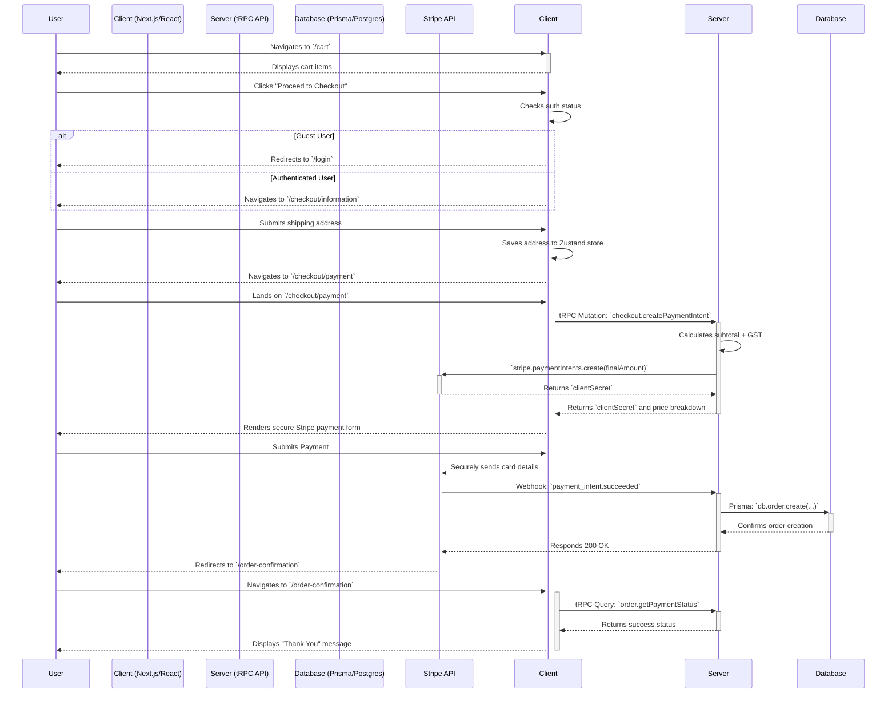

awesome job for an awesome design! but I believe you can do even better. please put on your deep-thinking hat to deeply and thoroughly explore via long chain of thought to carefully and systematically explore how you will re-imagine an even more awesome and gorgeous design with equivalent user experience. then plan thoroughly and then create an even more comprehensive and detailed PRD for your re-imagined e-commerce website. you can consider to add the following elements as part of your re-imagined design and PRD.

**Core Features**

The application has robust architecture that is robust and tested.

| Feature Area                      | Status                     | Notes                                                                                                                             |
| --------------------------------- | -------------------------- | --------------------------------------------------------------------------------------------------------------------------------- |
| **Multi-Step Checkout Flow**      | ✅ **Implemented**         | A robust, multi-step checkout process (`/information` -> `/payment`) that correctly handles addresses and server-side payment intent creation. |
| **Server-Side Tax Calculation**   | ✅ **Implemented**         | Secure, server-side GST (9% for SG) calculation, with the final price breakdown displayed to the user before payment.               |
| **User Authentication**           | ✅ **Implemented**         | Secure login (with guest redirect), registration, and session management via NextAuth.js. All sensitive routes protected by Edge middleware. |
| **Full Account Management**       | ✅ **Implemented**         | A comprehensive user dashboard for viewing order history and managing profile settings and multiple shipping addresses.             |
| **Global Notification System**    | ✅ **Implemented**         | A non-intrusive toast notification system (`react-hot-toast`) provides clear feedback for actions like adding items to the cart or updating a profile. |
| **Dynamic Product Catalog**       | ✅ **Implemented**         | Dynamic product listing (PLP) and detail (PDP) pages with client-side filtering by category, search, price, and sorting.          |
| **Shopping Cart & State**         | ✅ **Implemented**         | A dedicated cart page and a slide-out drawer confirmation. Cart state is persisted across sessions using `localStorage`.         |
| **3D Product Viewer**             | ✅ **Implemented**         | Interactive 3D models on product pages for an immersive experience, built with React Three Fiber.                               |
| **Payments & Order Persistence**  | ✅ **Implemented**         | A secure checkout form integrated with Stripe Elements and a reliable webhook system for creating database records of successful orders. |
| **Headless CMS (Journal)**        | ✅ **Implemented**         | A full-featured blog/journal with content managed via Sanity.io, rendered seamlessly within the Next.js app.                      |
| **SEO & Performance**             | ✅ **Implemented**         | Dynamic `sitemap.xml` and `robots.txt`, advanced caching (ISR/SSG), and bundle analysis configured.                           |

**System Interaction Flowchart**

This diagram illustrates how a user request flows through the various parts of our system, from the client to the database and external services, including the updated multi-step checkout flow.

**Key File & Directory Descriptions**

| Path                          | Purpose & Key Interactions                                                                                                                                                                                                                                                         |
| ----------------------------- | ---------------------------------------------------------------------------------------------------------------------------------------------------------------------------------------------------------------------------------------------------------------------------------- |
| `app/(shop)/checkout/[...step]/page.tsx` | **Checkout Flow Controller.** The heart of the new multi-step checkout. This single page component uses the URL parameter (`/information`, `/payment`) to conditionally render the correct step component (`InformationStep` or `PaymentStep`). It is responsible for orchestrating the flow and triggering the server-side payment intent creation at the appropriate time. |
| `components/features/checkout/InformationStep.tsx` | **Address Form UI.** A client component dedicated to the first step of checkout. It handles rendering the shipping address form, displaying a list of saved addresses for logged-in users, and saving the chosen address to the checkout store before navigating to the next step. |
| `components/features/checkout/PaymentStep.tsx` | **Payment Form UI.** A client component for the final checkout step. Its sole responsibility is to render the Stripe `PaymentElement` and handle the final payment submission. It receives all necessary data via props from its parent controller page. |
| `store/checkout.store.ts`     | **Checkout State Management.** A new Zustand store that holds temporary data for the duration of the checkout flow, such as the selected shipping address. It uses `sessionStorage` to persist this data across page reloads within the same browser tab, but clears it when the session ends. |
| `lib/config/shop.ts`          | **Shop-wide Constants.** A new centralized file for defining business logic constants like the `GST_RATE` and default country codes. This ensures maintainability and a single source of truth for financial calculations. |
| `middleware.ts`               | **Edge Route Protection.** This file is critical for security. Its `matcher` is configured to protect all routes under `/account/*` and `/checkout/*`, automatically redirecting any unauthenticated users to the login page before any page content is served. |
| `server/routers/order.ts`     | **Order-Related Backend Logic.** This tRPC router has been enhanced with a `getPaymentStatus` procedure. This allows the client to securely ask our backend for the status of a Stripe payment, rather than having the client communicate directly with the Stripe API post-payment. |

---

**Technology Stack**

| Category                   | Technology                                                                                                  | Rationale & Purpose                                                                                                                                                                    |
| -------------------------- | ----------------------------------------------------------------------------------------------------------- | -------------------------------------------------------------------------------------------------------------------------------------------------------------------------------------- |
| **Framework & UI**         | [Next.js](https://nextjs.org/  ), [React](https://react.dev/  ), [Tailwind CSS](https://tailwindcss.com/  ), [Framer Motion](https://www.framer.com/motion/  ) | A high-performance stack for building fast, SEO-friendly, and interactive user interfaces with fluid animations.                                                              |
| **API & Type Safety**      | [tRPC](https://trpc.io/  ), [Zod](https://zod.dev/  )                                                            | Provides an unparalleled developer experience with full end-to-end type safety between the client and server, eliminating the need for manual API contract management or code generation. |
| **Database & ORM**         | [PostgreSQL](https://www.postgresql.org/  ), [Prisma](https://www.prisma.io/  )                                    | A robust, relational database combined with a next-generation ORM that provides a fully type-safe data access layer.                                                              |
| **Authentication**         | [NextAuth.js](https://next-auth.js.org/  )                                                                      | A complete, secure, and extensible authentication solution for Next.js, handling sessions, OAuth providers, and route protection via middleware.                                      |
| **Payments**               | [Stripe](https://stripe.com/  )                                                                                 | The industry standard for secure and reliable online payments, integrated via Stripe Elements on the client and webhooks on the server.                                                   |
| **Headless CMS**           | [Sanity.io](https://www.sanity.io/  )                                                                           | A flexible headless CMS for managing dynamic content like the "Journal" section, decoupling content creation from the main application codebase.                                       |
| **State Management**       | [Zustand](https://zustand-demo.pmnd.rs/  )                                                                        | A simple, fast, and scalable state management solution for global client-side state. Used for the cart, UI theme, and the temporary checkout state.                                   |
| **Notifications**          | [React Hot Toast](https://react-hot-toast.com/  )                                                               | A lightweight and customizable library for providing non-intrusive "toast" notifications for user feedback.                                                                            |

**Project File Hierarchy**
LuxeVerse/
│
├── 📄 .env.local             # Local secrets and environment variables (GIT-IGNORED)
├── 📄 next.config.js          # Next.js framework configuration (image domains, redirects)
├── 📄 tailwind.config.ts      # Tailwind CSS theme, plugins, and custom styles
├── 📄 package.json             # Project scripts and dependencies
│
├── 📁 app/                     # ✅ NEXT.JS APP ROUTER: All pages, layouts, and API routes
│   ├── 📁 (auth)/              # Route group for authentication pages (login, register)
│   ├── 📁 (shop)/              # Route group for e-commerce pages
│   │   ├── 📁 checkout/
│   │   │   └── 📁 [...step]/    # Catch-all route for multi-step checkout
│   │   │       └── 📄 page.tsx # Controller component for checkout steps
│   │   ├── 📁 products/
│   │   └── 📁 cart/
│   ├── 📁 account/             # Protected user account pages (dashboard, profile, orders)
│   ├── 📁 api/                  # Server-side API routes
│   │   ├── 📁 trpc/[trpc]/      # Main tRPC API endpoint
│   │   └── 📁 webhooks/stripe/  # Endpoint for handling Stripe payment webhooks
│   ├── 📄 layout.tsx           # The root layout for the entire application
│   └── 📄 page.tsx             # The homepage component
│
├── 📁 components/              # ✅ REACT COMPONENTS: All UI building blocks
│   ├── 📁 common/              # Generic, reusable design system components (Button, Card)
│   ├── 📁 features/           # Components for specific business features
│   │   └── 📁 checkout/         # NEW: Components for each checkout step
│   │       ├── 📄 InformationStep.tsx
│   │       └── 📄 PaymentStep.tsx
│   └── 📁 providers/          # Global client-side context providers
│
├── 📁 lib/                      # ✅ SHARED LOGIC: Utilities, services, and configurations
│   ├── 📁 auth/               # NextAuth.js configuration
│   ├── 📁 config/             # Application-wide constants (GST rate, sorting options)
│   ├── 📁 db/                 # Prisma client singleton instance
│   └── 📁 validation/         # Zod validation schemas
│
├── 📁 server/                   # ✅ TRPC BACKEND: The core API logic
│   ├── 📁 routers/            # Individual tRPC routers for each domain (product, user, order)
│   ├── 📄 context.ts           # tRPC request context creation (injects session, prisma)
│   └── 📄 trpc.ts              # tRPC initialization and middleware (e.g., protectedProcedure)
│
├── 📁 prisma/                   # ✅ DATABASE: Schema, migrations, and seeding
│   ├── 📄 schema.prisma        # The single source of truth for the database schema
│   └── 📄 seed.ts              # Script to populate the dev database
│
├── 📁 store/                    # ✅ GLOBAL STATE: Client-side state management (Zustand)
│   ├── 📄 cart.store.ts         # Manages the shopping cart state
│   ├── 📄 checkout.store.ts    # Manages state for the multi-step checkout flow
│   └── 📄 ui.store.ts           # Manages UI state like the current theme
│
└── 📁 public/                   # ✅ STATIC ASSETS: Images, icons, videos, 3D models
